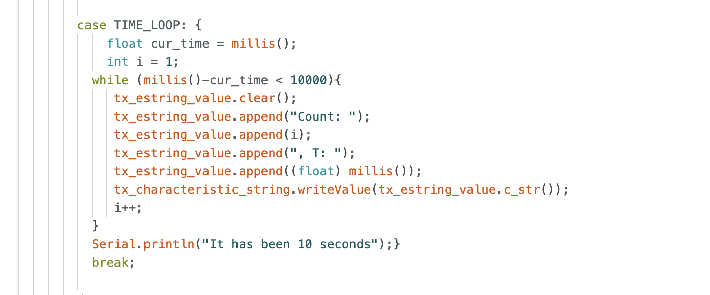
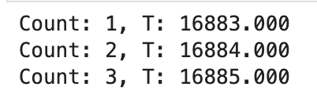
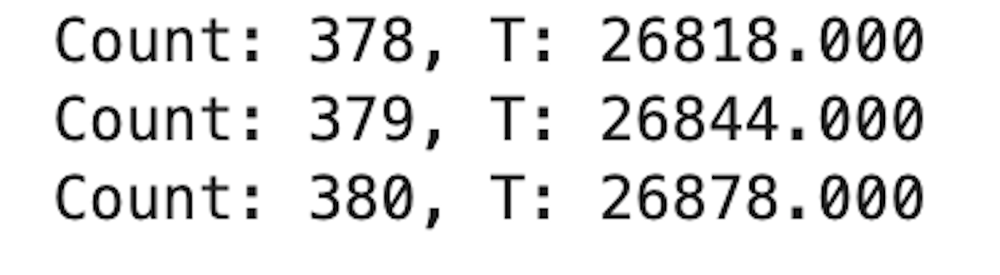
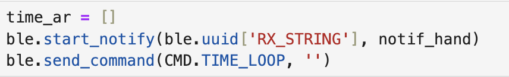

# Lab 1 

## Lab 1A: The Artemis Board

The purpose of this lab was to become more familiar with programming using Arduino IDE and the Artemis board. 

## Lab 2A: Bluetooth

The purpose of this lab was to test Bluetooth by learning how to use Jupyter lab notebooks in conjunction with the Arduino IDE to communicate with the Artemis board. 

### Prelab

ADD SOMETHING HERE

### Configuration

ADD SOMETHING HERE

### Task 1: ECHO Command

First, I completed the ECHO command in Arduino IDE. This command can be seen below. 

 

I then called the command in Jupyter, using the code shown below. The command sends the robot "HiHello" and the robot returns "Robot says -> HiHello."

 

### Task 2: SEND_THREE_FLOATS Command

As with the ECHO command, in order to implement SEND_THREE_FLOATS, I first had to write the necessary code to perform the desired task in Arduino. This code can be seen below.

 

I then called SEND_THREE_FLOATS using the Jupyter Notebook code shown in the image below. 

 

This prompted the Artemis to output the floats to the Serial Monitor.

 

### Task 3: GET_TIME_MILLIS

As with the first two tasks, GET_TIME_MILLIS needed to be implemented in Arduino. Unlike before, the GET_TIME_MILLIS did not exist in either Arduino or in Jupyter lab. In order to create the command, it first had to be added to enum CommandTypes in Arduino and cmd_types.py, as seen below. I repeated this process when creating commands in Arduino for tasks 4-7.

 

 

After the command names were updated, I was able to create the GET_TIME_MILLIS in Arduino IDE.

 

 

Then, the following python code was implemented in Jupyter Notebook to obtain the time in milliseconds from the Arduino in the format of "T: " followed by 6 digits.

 

 

### Task 4: Notification Handler

In order to extract time from the string value sent by the Artemis board, I set up a notification handler. The notification handler, shown below, is able to handle three different cases. These cases include different formatting of the timestamp data as well as the addition of temperature data. These three cases pertain to tasks 5, 6, and 7, respectively. Therefore, the notification manager can be used properly for all three tasks. 

 

 

### Task 5: Data Transfer via Loop Method

To test the effective data transfer rate of Bluetooth communication between my computer and the Artemis board, I created a loop in Arduino that obtained the time in milliseconds and then sent it to Jupyter Lab on my computer. Once called, the loop ran for 10 seconds. In addition to recording the time, I kept track of how many times the loop ran during the 10 seconds. This "count" was sent to computer along with the time in milliseconds to more easily calculate the average effective data transfer rate over 10 seconds. The code is shown below. 

 

 

The notification handler was responsible for receiving and processing the time sent to the computer by the Artemis board. It separated time and count values, placing time values into an array. In order to better visualize the data being sent from the Artemis board, the notification handler printed both count and time in milliseconds. The beginning and end of a sample output can be seen below. 

 

 

Since approximately 380 time values were transferred from the Artemis board to my computer within 10 seconds, the effective data transfer rate using this method is 38 values per second on average.  

Finally, the code that was called in Jupyter notebook to activate the notification handler and the time loop can be seen below. 

 

 

### Task 6: Data Transfer via Array Method

As above in task 5, the purpose of this task is to send timestamps from the Artemis board to my computer. However, to improve efficiency, each time stamp was placed into an array in Arduino. This array, along with the temperature array used in task 7, had to be defined globally to allow them to be accessed outside of the loop command. 

EXPLAIN WHY CHOSE 500 AS ARRAY SIZE (GOT _X_ SECONDS, ENOUGH TO DETERMINE EFFICIENCY WITHOUT WASTING TOO MUCH STORAGE)

ADD GLOBAL ARRAY PIC

Creating these arrays allowed all the values entire array to be sent back at once, instead of one value at a time. I created a command, TIME_LOOP_ARR, in Arduino to add the timestamp values to the timestamp array. I recorded the time values in microseconds instead of milliseconds because I wanted greater accuracy when calculating the rate of data transfer for this method. 

ADD LOOP FUNCTION PIC

Then, I created the SEND_TIME_DATA command which looped over the timestamp array to send the timestamps to the computer. 

ADD SEND COMMAND PIC

The Jupyter notebook code used to call the commands and activate the notification handler can be seen below. The loop command was called first to generate the array, and then the notification handler was activated in order to properly receive and process the timestamps sent to the computer. 

ADD JUPYTER PIC

The beginning and end of a sample output can be seen below. This method was much more efficient, as 500 timestamps were recorded in only ____ seconds. Therefore, the effective data transfer rate using this method was found to be ___ values per second on average.

ADD SAMPLE OUTPUT PIC
