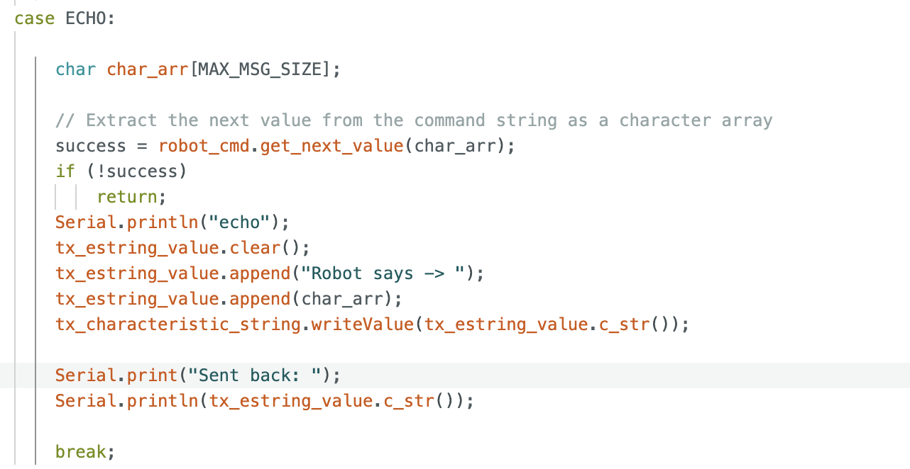
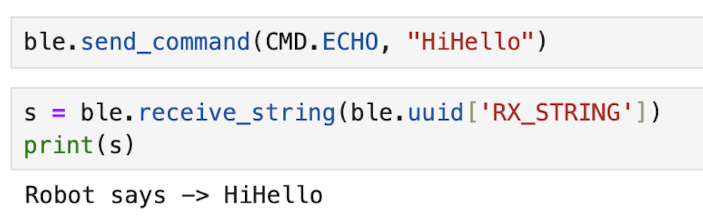
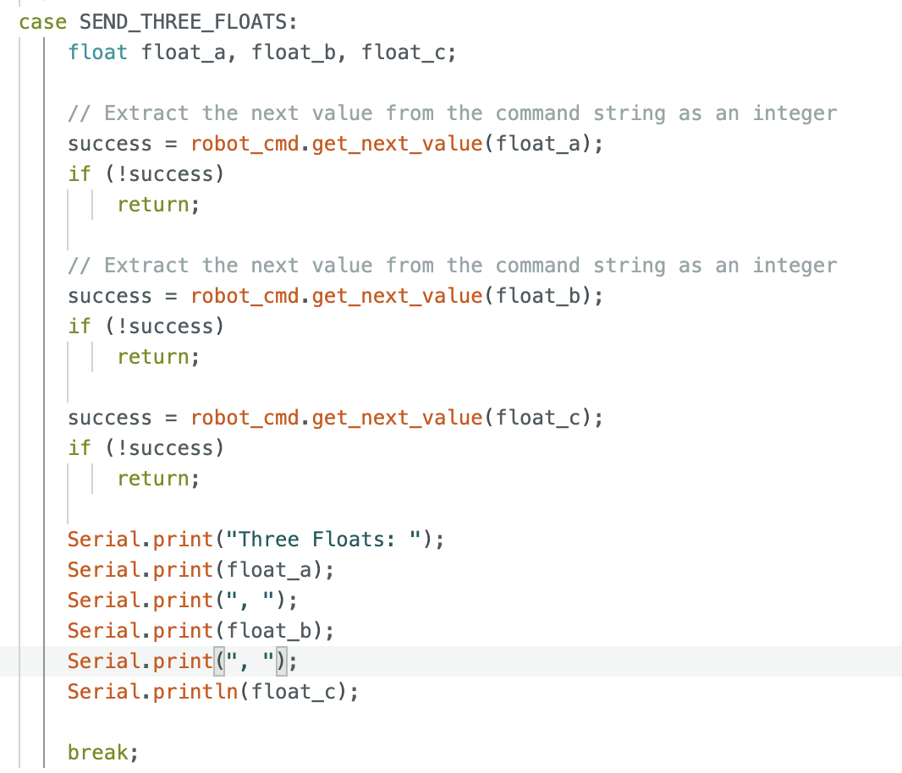
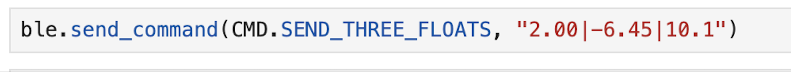
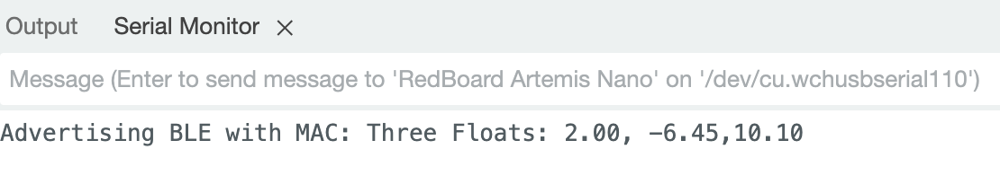
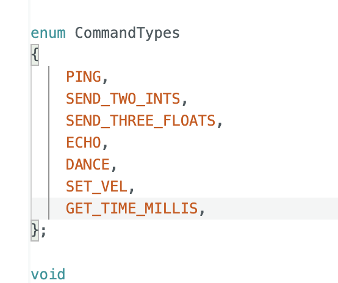
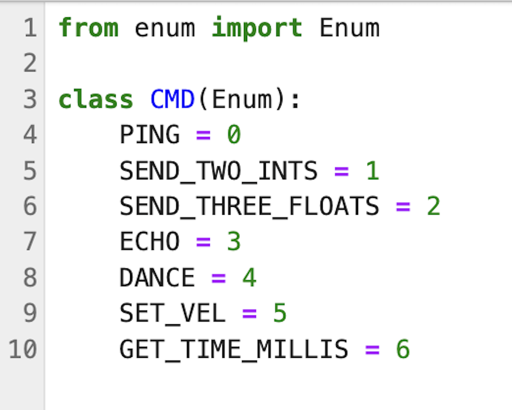
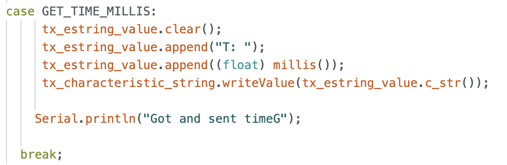
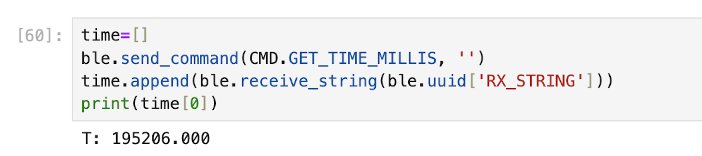

# Lab 1 

## Lab 1A: The Artemis Board

The purpose of this lab was to become more familiar with programming using Arduino IDE and the Artemis board. 

## Lab 2A: Bluetooth

The purpose of this lab was to test Bluetooth by learning how to use Jupyter lab notebooks in conjunction with the Arduino IDE to communicate with the Artemis board. 

### Task 1: ECHO Command

First, I completed the ECHO function in Arduino IDE. This function can be seen below. 

 

I then called the function in Jupyter, using the code shown below. The command sends the robot "HiHello" and the robot returns "Robot says -> HiHello."

 

### Task 2: SEND_THREE_FLOATS Command

As with the ECHO command, in order to implement SEND_THREE_FLOATS, I first had to write the necessary code to perform the desired task in Arduino. This code can be seen below.

 

I then called SEND_THREE_FLOATS using the Jupyter Notebook code shown in the image below. 

 

This prompted the Artemis to output the floats to the Serial Monitor.

 

### Task 3: GET_TIME_MILLIS

As with the first two tasks, GET_TIME_MILLIS needed to be implemented in Arduino. Unlike before, the GET_TIME_MILLIS did not exist in either Arduino or in Jupyter lab. In order to create the command, it first had to be added to enum CommandTypes in Arduino and cmd_types.py, as seen below. 

 

 

After the command names were updated, I was able to create the GET_TIME_MILLIS in Arduino IDE.

 

 

Then, the following python code was implemented in Jupyter Notebook to obtain the time in milliseconds from the Arduino in the format of "T: " followed by 6 digits.

 

 

