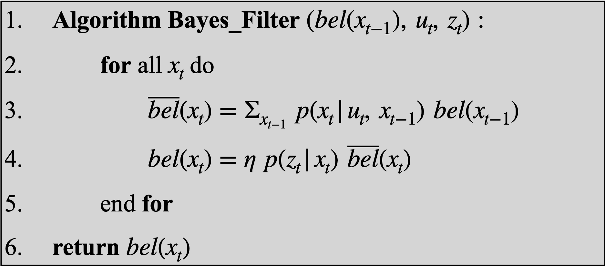

# Lab 10: Grid Localization using Bayes Filter

## Overview

Since robots do not inherently know where they are located, robot localization is commonly used to determine where they are with respect to their environment. Localization works best when probablilistic methods are used in conjunction with sensors.

To the robot, the world is a continuous 3D space with dimensions x, y, and θ. In order to perform calculations, the space is discretized into 1 x 1 ft cells with 20 degrees of orientation. The map is further constrained to [-5.5, 6.5) ft in the x direction, [-4.5, 4.5) ft in the y direction, and [-180, 180) in θ. These constraints are a result of the map, which is the same as Lab 9. Therefore, the total number of cells are 12, 9, and 18, respectively. 

As the robot moves, these cells are updated with the probability, calculated using Bayes filter, that the robot is in the corresponding position and orientation. The probability values across all cells should always sum to 1. By recording which cell has the highest probability after every step, we can follow the robot's progress through the environment with a degree of accuracy. 

## Bayes Filter Implementation

In order for the robot to accurately calculate cell probabilities, the following Bayes filter algorithm needed implementation: 

 

 

Implementation was done in python by completing the helper functions outlined in the lab 10 notebook. 

### compute_control()

This function takes inputs of the previous and current robot positions (x, y, θ). From these, it calculates the initial rotation, translation, and final rotation in order to model the robot's movement.

<pre><code class="language-python">
def compute_control(cur_pose, prev_pose):
    """ Given the current and previous odometry poses, this function extracts
    the control information based on the odometry motion model.

    Args:
        cur_pose  ([Pose]): Current Pose
        prev_pose ([Pose]): Previous Pose 

    Returns:
        [delta_rot_1]: Rotation 1  (degrees)
        [delta_trans]: Translation (meters)
        [delta_rot_2]: Rotation 2  (degrees)
    """

    x_cur, y_cur, theta_cur = cur_pose
    x_prev, y_prev, theta_prev = prev_pose
    
    delta_rot_1 = mapper.normalize_angle(np.degrees(np.arctan2(y_cur - y_prev, x_cur - x_prev)) - theta_prev,)
    delta_trans = np.hypot(y_cur - y_prev, x_cur - x_prev)
    delta_rot_2 = mapper.normalize_angle(theta_cur - theta_prev - delta_rot_1)

    return delta_rot_1, delta_trans, delta_rot_2
</code></pre>

### odom_motion_model()

First, this function obtains odometry values by utilizing compute_control(). Then, it calculates their individual probabilities and returns the overall probability that the robot is at this current state given a previous state. The individual probabilities are calculated using a Gaussian distribution centered on the control input with the given standard deviations. 

<pre><code class="language-python">
def odom_motion_model(cur_pose, prev_pose, u):
    """ Odometry Motion Model

    Args:
        cur_pose  ([Pose]): Current Pose
        prev_pose ([Pose]): Previous Pose
        (rot1, trans, rot2) (float, float, float): A tuple with control data in the format 
                                                   format (rot1, trans, rot2) with units (degrees, meters, degrees)

    Returns:
        prob [float]: Probability p(x'|x, u)
    """
    
    delta_rot_1, delta_trans, delta_rot_2 = compute_control(cur_pose, prev_pose)

    prob_rot_1 = loc.gaussian(delta_rot_1, u[0], loc.odom_rot_sigma)
    prob_trans = loc.gaussian(delta_trans, u[1], loc.odom_trans_sigma)
    prob_rot_2 = loc.gaussian(delta_rot_2, u[2], loc.odom_rot_sigma)

    prob = prob_rot_1 * prob_trans * prob_rot_2

    return prob
</code></pre>

### prediction_step()

This purpose of this function is to calculate the belief probabilities. Essentially, it does this by obtaining the odometry values, looping over all the cells, and implementing the equation in line 3 of the Bayes filter algorithm shown above. To decrease run time, probabilities smaller than 0.0001 are ignored because they do not contribute significantly to the overall summed belief. Once all beliefs have been calculated, they are normalized so that they sum to 1. 

<pre><code class="language-python">
def prediction_step(cur_odom, prev_odom):
    """ Prediction step of the Bayes Filter.
    Update the probabilities in loc.bel_bar based on loc.bel from the previous time step and the odometry motion model.

    Args:
        cur_odom  ([Pose]): Current Pose
        prev_odom ([Pose]): Previous Pose
    """
    u = compute_control(cur_odom, prev_odom)

    loc.bel_bar = np.zeros((mapper.MAX_CELLS_X, mapper.MAX_CELLS_Y, mapper.MAX_CELLS_A))

    for x_prev in range(mapper.MAX_CELLS_X):
        for y_prev in range(mapper.MAX_CELLS_Y):
            for theta_prev in range(mapper.MAX_CELLS_A):
                if (loc.bel[x_prev, y_prev, theta_prev] < 0.0001): 
                    continue

                for x_cur in range(mapper.MAX_CELLS_X):
                    for y_cur in range(mapper.MAX_CELLS_Y):
                        for theta_cur in range(mapper.MAX_CELLS_A):
                            p = odom_motion_model(mapper.from_map(x_cur, y_cur, theta_cur), mapper.from_map(x_prev, y_prev, theta_prev), u)
                            loc.bel_bar[x_cur, y_cur, theta_cur] += p * loc.bel[x_prev, y_prev, theta_prev]

    loc.bel_bar /= np.sum(loc.bel_bar)
</code></pre>

### sensor_model()

Based off the input of observations, this function calculates the probability for each sensor reading given the current state. Probability is calculated as a Gaussian distribution using the given standard deviations. 

<pre><code class="language-python">
def sensor_model(obs):
    """ This is the equivalent of p(z|x).

    Args:
        obs ([ndarray]): A 1D array consisting of the true observations for a specific robot pose in the map 

    Returns:
        [ndarray]: Returns a 1D array of size 18 (=loc.OBS_PER_CELL) with the likelihoods of each individual sensor measurement
    """
    prob_array = []
    for i in range(mapper.OBS_PER_CELL):
        prob = loc.gaussian(obs[i], loc.obs_range_data[i], loc.sensor_sigma)
        prob_array.append(prob)

    return prob_array
</code></pre>

### update_step

This is the last helper function, and it is used to update our current belief. Essentially, it implements line 4 of the Bayes filter algorithm by looping through each cell, retrieving observations, calculating their probabilities, and updating the belief. Once all beliefs have been calculated, they are once again normalized so they sum to 1.

<pre><code class="language-python">
def update_step():
    """ Update step of the Bayes Filter.
    Update the probabilities in loc.bel based on loc.bel_bar and the sensor model.
    """
    for x_cur in range(mapper.MAX_CELLS_X):
        for y_cur in range(mapper.MAX_CELLS_Y):
            for theta_cur in range(mapper.MAX_CELLS_A):
                p = sensor_model(mapper.get_views(x_cur, y_cur, theta_cur))
                loc.bel[x_cur, y_cur, theta_cur] = np.prod(p) * loc.bel_bar[x_cur, y_cur, theta_cur]

    loc.bel /= np.sum(loc.bel)
</code></pre>

## Simulation 

### Without Bayes Filter 

First, I tested the simulation without Bayes filter. The robot's actual position, ground truth, is plotted in green while the odometry model is plotted in red. The odometry model quickly spirals away from ground truth, initially even moving opposite from the robot. As time goes on, it is able to more accurately follow the robots movements, but by then it is too far away to recover. This demonstrates that the odometry model is not great, since it gets off track easily and even moves through obstructions that the robot would not be able to pass through.

<iframe width="560" height="315" src="https://www.youtube.com/embed/hMIK-WirBL0?si=LwFPidiEPfxSHMSm" title="YouTube video player" frameborder="0" allow="accelerometer; autoplay; clipboard-write; encrypted-media; gyroscope; picture-in-picture; web-share" referrerpolicy="strict-origin-when-cross-origin" allowfullscreen></iframe>

 

### With Bayes Filter 

Then, I performed two tests that implemented Bayes filter in the simulation. Both runs are shown in the embedded videos below. In both cases, it is clear that the probabilistic belief calculated using Bayes, plotted in blue, performs much better than the odometry model, plotted in red. It tracks very close to ground truth, plotted in green, especially near the walls. It appears that because the robot is able to record more measurements when near obstacles probability calculations improve. Overall, the probabilistic belief tracks with the robot very well, and I did not see it deviate significantly in any run. 

<iframe width="560" height="315" src="https://www.youtube.com/embed/rbNj0ggS3gU?si=EQncHkGLd01bV1YM" title="YouTube video player" frameborder="0" allow="accelerometer; autoplay; clipboard-write; encrypted-media; gyroscope; picture-in-picture; web-share" referrerpolicy="strict-origin-when-cross-origin" allowfullscreen></iframe>

 

<iframe width="560" height="315" src="https://www.youtube.com/embed/5kEn7e_lVv8?si=Ig_vvkQKQv4OH06J" title="YouTube video player" frameborder="0" allow="accelerometer; autoplay; clipboard-write; encrypted-media; gyroscope; picture-in-picture; web-share" referrerpolicy="strict-origin-when-cross-origin" allowfullscreen></iframe>

 

### Acknowledgements 

I referenced Stephan Wagner's lab report from last year. In addition, I referenced Lulu's lab report to see more examples of successful simulation runs. 
