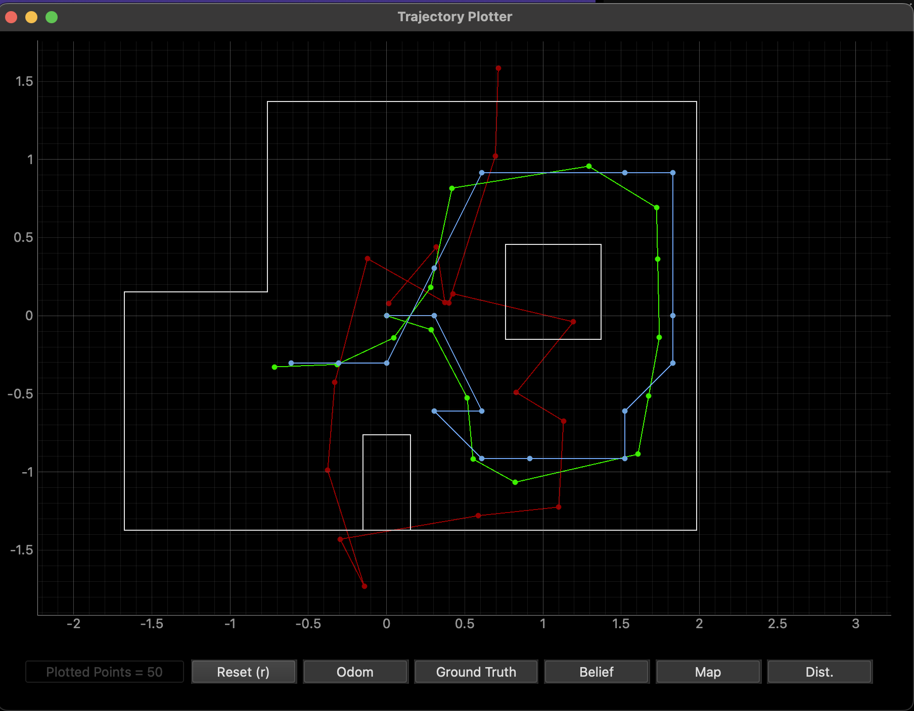
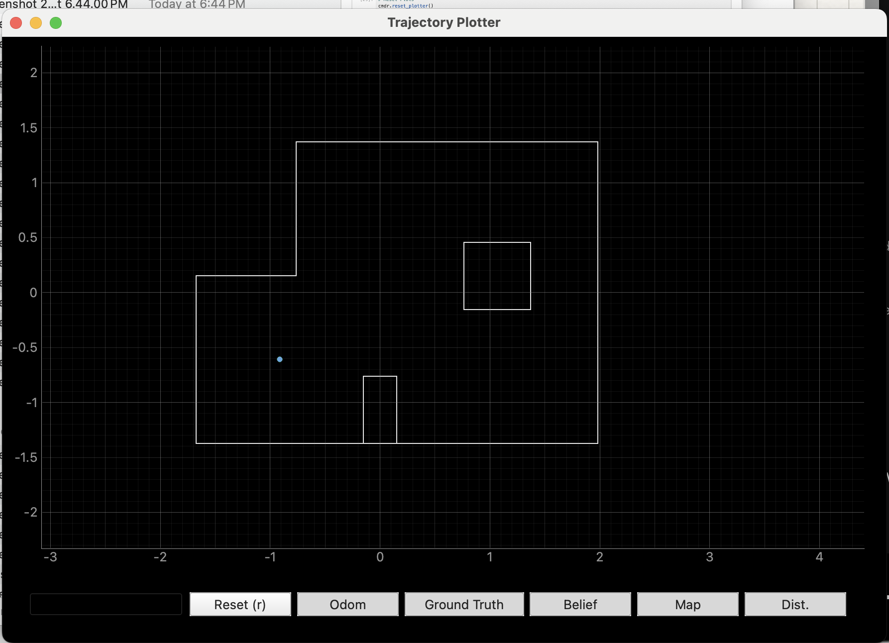
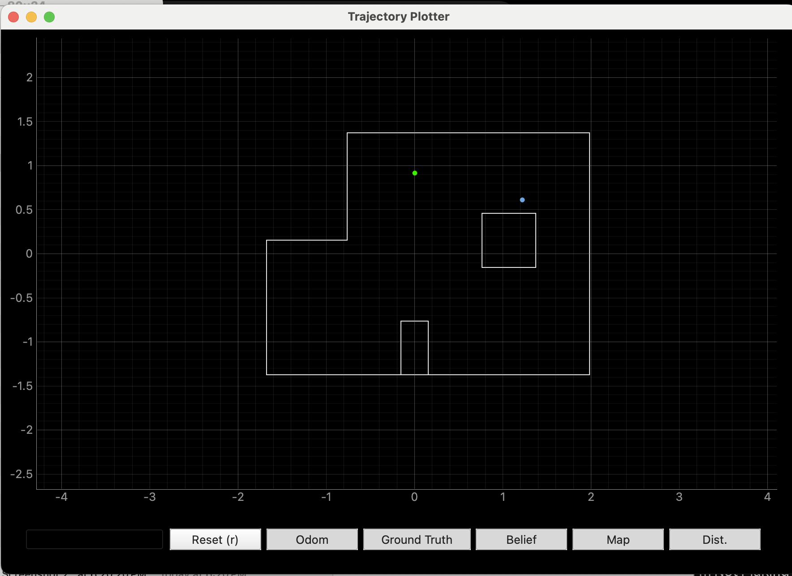
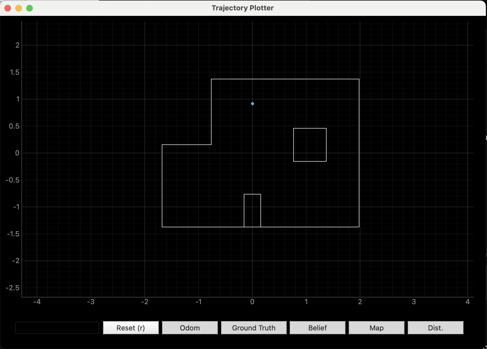
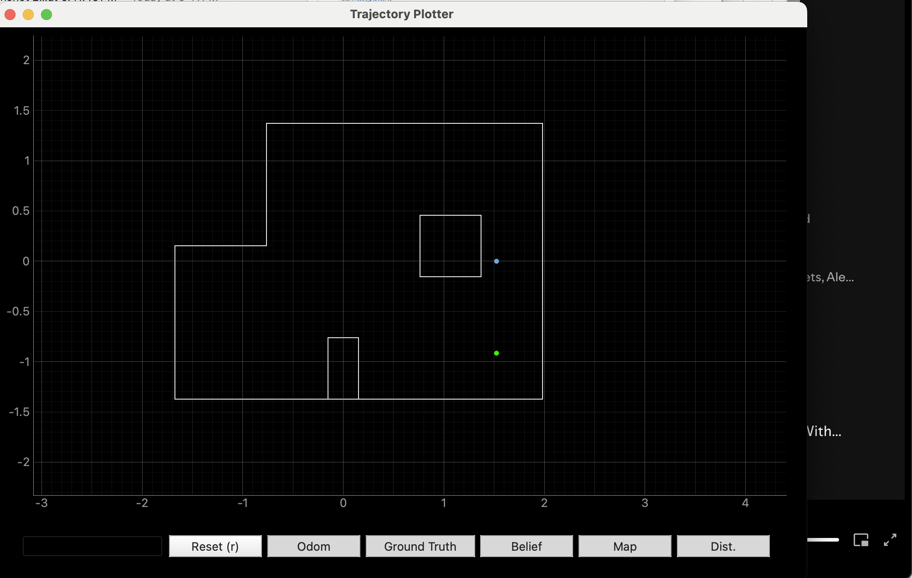
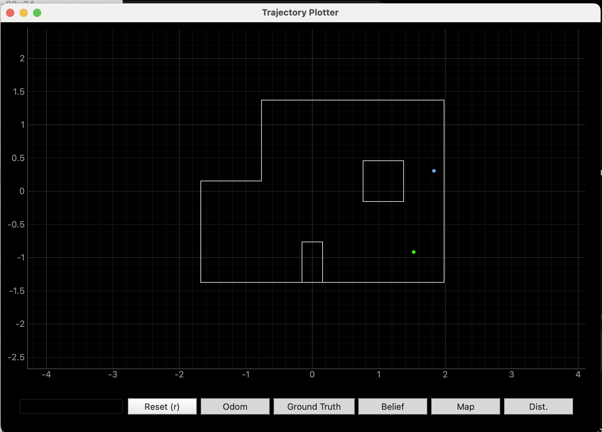
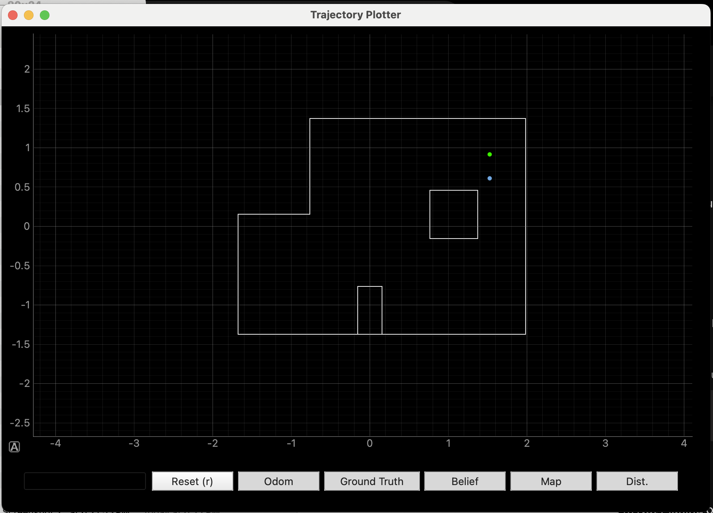

# Lab 11: Localization on the Real Robot

## Simulation Test

Before testing on my robot, I ran localization in simulation using the lab11_sim.ipynb notebook. The results of this test can be seen in the image below. As in Lab 10, the probabilistic belief, plotted in blue, was much closer to ground truth, green, than odometry, red. 

 

 

This result verified the Localization class since the probabilistic belief, calculated using Bayes, behaved accurately with respect to ground truth.

## Implementating Localization on the Robot

Once I determined that Localization functioned correctly, I implemented perform_observation_loop() in the RealRobot class found in the lab11_real.ipynb notebook. This function was implemented using my START_MAP and SEND_MAP functions from Lab 9. START_MAP causes the robot to rotate 360 degrees in place while collecting distance data from the TOF sensor at specified increments. In order to perform the localization, I had to change the yaw angle increment from 10 to 20 degrees. This decreased the number of data points collected per run from 36 to 18. After the data is collected, SEND_MAP is used to send the time, distance, and yaw data from the robot so it can be processed by the notification handler and analyzed. For reference, the modified Lab 9 code has also been attached at the end of this lab report. 

<pre><code class="language-python">
   def perform_observation_loop(self, rot_vel=120):
        """Perform the observation loop behavior on the real robot, where the robot does  
        a 360 degree turn in place while collecting equidistant (in the angular space) sensor
        readings, with the first sensor reading taken at the robot's current heading. 
        The number of sensor readings depends on "observations_count"(=18) defined in world.yaml.
        
        Keyword arguments:
            rot_vel -- (Optional) Angular Velocity for loop (degrees/second)
                        Do not remove this parameter from the function definition, even if you don't use it.
        Returns:
            sensor_ranges   -- A column numpy array of the range values (meters)
            sensor_bearings -- A column numpy array of the bearings at which the sensor readings were taken (degrees)
                               The bearing values are not used in the Localization module, so you may return a empty numpy array
        """
        global time, dist, yaw
        time = []
        dist = []
        yaw = []

        ble.send_command(CMD.START_MAP, "")

        LOG.info('Collecting data...')

        import asyncio 
        asyncio.run(asyncio.sleep(35))

        LOG.info('Receiving data...')

        self.ble.start_notify(ble.uuid['RX_STRING'], notif_hand)
        self.ble.send_command(CMD.SEND_MAP, '')

        asyncio.run(asyncio.sleep(5))

        LOG.info('Finished')

        ble.stop_notify(ble.uuid['RX_STRING'])

        sensor_ranges = (np.array(dist)[np.newaxis].T)/1000
        sensor_bearings = np.array(yaw)[np.newaxis].T

        return sensor_ranges, sensor_bearings
</code></pre>

Note that I used asyncio.sleep() to ensure the python code would not continue until the robot executed its commands. This ensured that all data was collected and sent back without blocking or being blocked by the execution of perform_observation_loop(). In addition, after the distance and yaw data were received, I made sure to convert the lists to a numpy column array so they could be properly utilized in the localization code. Before this conversion, each data point was converted into a float in the notification handler, which is shown below, so that calculations could be done properly.

<pre><code class="language-python">
def notif_hand(uuid, b_to_extract):
    s_from_b = ble.bytearray_to_string(b_to_extract)
    split_ar = s_from_b.split("|")
    time.append(float(split_ar[0][6:]))
    dist.append(float(split_ar[1][10:]))
    yaw.append(float(split_ar[2][5:]))
    if(len(time)>17):
        print("collected")
</code></pre>

In the video below, the modified START_MAP command is executed on my robot. It completes a full 360 degree turn, stopping at approximately 20 degree intervals to record a total of 18 distance measurements. 

<iframe width="560" height="315" src="https://www.youtube.com/embed/FXrP-YpP6zI?si=r9Uc4wecv_zWGNDd" title="YouTube video player" frameborder="0" allow="accelerometer; autoplay; clipboard-write; encrypted-media; gyroscope; picture-in-picture; web-share" referrerpolicy="strict-origin-when-cross-origin" allowfullscreen></iframe>

 

## Results

After verifying that the START_MAP and SEND_MAP commands worked, I began testing localization with my robot. I tested at all four locations, and the results are shown below. Before each test, I made sure the robot was centered on each location and the TOF sensor started facing right in the map, as this corresponded to 0 degrees. 

### Marked Pose 1: (-3 ft, -2 ft, 0 deg) or (-.9144 m, -.6096 m, 0 deg)

Localization was the most accurate at the first marked pose. During both my tests, I got nearly perfect results. For both, the belief was (-0.914, -0.610, 10) with probabilities of 0.9999999 and 1.0. One of the resulting maps is shown below. The ground truth location is also being plotted, but is not visible since it overlaps with the belief. 

 

 

### Marked Pose 2: (0 ft, 3 ft, 0 deg) or (0 m, 0.9144 m, 0 deg)

Localization was also quite accurate at this marked pose. On my first trial, the belief obtained was (1.219, 0.610, 170) with a probability of approximately 0.998. This result is shown as the blue dot in the map below. Ground truth is plotted in green. Although not entirely accurate, this localization was able to properly place the robot in the upper half of the map. It just seems to have confused the top wall for the wall of the obstruction in the middle of the map which likely occurred because the TOF sensor is at the front of the robot, so distance measurements may have been smaller than expected during the run. 

 

 

However, I saw a great improvement in localization on my second trial. This time, the belief was nearly perfect, as it was (0, 0.914, -10) with a probability of 0.9999999. This is evident in the map shown below, as ground truth is not visible since it overlaps with the belief. 

 

 

### Marked Pose 3: (5 ft, -3 ft, 0 deg) or (1.524 m, -0.9144 m, 0 deg)

This marked pose proved the most difficult for the robot to predict using localization. Even after attempting a few times, I was not able to get a resulting belief in the bottom right quadrant, let alone a perfect localization. My two closest beliefs were (1.524, 0.000, -130.000) with probability 0.9994 and (1.829, 0.305, 70.000) with probability 0.9999. The maps with these beliefs plotted are shown below, respectively. Although the belief locations were not entirely accurate, it is worth noting that the results were repeatable across trials, since the belief values were both between the obstruction and the right wall.

  

 

### Marked Pose 4: (5 ft, 3 ft, 0 deg) or (1.524 m, 0.9144 m, 0 deg)

Although I was not able to get a perfect localization at this point, the beliefs I obtained were relatively accurate and consisent across trials. The belief values obtained were (1.219, 0.610, 10.000) and (1.524, 0.610, -10.000), both with probaility 0.9999999. The resulting maps for these two trials are shown below, respectively. The second trial was able to accurately predict the x coordinate of the robot. However, in both cases, the y coordinate was 1 unit below the true location. This may be a result of the fact that the TOF sensor is located at the front of the robot, which could result in smaller distance values than expected when the robot is facing the square obstruction. 

  

 

## Discussion 

After testing at all four marked poses, it is evident that the robot is able to localize better in poses 1 and 2. It has the hardest time localizing in pose 3. 1 and 2 are likely easier to determine because they both have walls on two sides, and mostly open space on the other two sides. The open space is not as present on the right side of the map, which helps to narrow it down. In addition, the walls are at 180 and 270 degrees for location 1 but 90 and 180 degrees for location 2. This difference allows them to be easily distinguished from one another.

As mentioned, there is less open space on the right side of the lab. This makes it more likely that the robot will measure some sort of wall at the majority of its intervals, which could correspond to a variety points all along the right wall. For example, at marked pose 4 the robot detected obstacles at 0, 90, and 270 degrees. However, this would have been the case at most points along the right wall due to the presence of the square cutout in the middle of the map. This made it harder to accurately determine the robot's location when it was in this pose. 

Although marked pose 3 was not predicted exactly, the beliefs obtained were very close. As mentioned, they were consistently a unit lower in the y-coordinate. This likely occurred because the TOF sensor was at the front of the robot, and was therefore closer to the wall of the square cutout than expected. This emphasizes the need for a translation or transformation to account for the location of the TOF sensor, since it is not placed at the very center of the robot. 

## Reference Code

I have attached the modified Lab 9 code below. When START_MAP is called, the RECORD_MAP flag is turned on, which allows the robot to execute its 360 degree turn and data collection. 

<pre><code class="language-cpp">
      if(RECORD_MAP)
      {
       int dist;
       float yaw_tot;
       float cur_time;
       float dt_map;
       int pwm;
       float yaw_prev;
       float yaw_g;
       //Initial distance measurement (robot doesn't need to start moving)
       if(FIRST_ANGLE)
       {
        delay(2000);
          if (distanceSensor_1.checkForDataReady()) {
            meas_dist = distanceSensor_1.getDistance();
            yaw_tot = 0;
           
            time_map[map_meas] = millis();
            dist_map[map_meas]=meas_dist;
            yaw_map[map_meas] = yaw_tot;

            map_meas++;
            distanceSensor_1.clearInterrupt();
            distanceSensor_1.stopRanging();
            distanceSensor_1.startRanging();
            FIRST_ANGLE = false;
            des_angle = 20;
          }
       }
       else{
         if(map_meas < 18)
         {
           float pid_t0 = millis();
           while(millis()-pid_t0 < 1500 && RECORD_MAP)
           {
            cur_time = millis();
            dt_map = (cur_time-prev_time_ori)/1000;

            prev_time_ori = cur_time;

            if(myICM.dataReady())
            {
             myICM.getAGMT();
             double yaw_g = myICM.gyrZ();

             yaw_tot = yaw_tot + yaw_g*dt_map;

             pwm = calc_speed_ori(yaw_tot, des_angle, dt_map);
            
             if(abs(yaw_tot-des_angle) < 2 || yaw_tot > des_angle)
             {
               analogWrite(1, 0);
               analogWrite(2, 0);
               analogWrite(0, 0);
               analogWrite(5,0);
               delay(50);
             }
             else if(pwm>0)
             {
              if(pwm > 130)
              {
               pwm = 130;
              }
             }
             else
             {
               pwm=abs(pwm);
               if(pwm > 115)
               {
                 pwm = 115;
               }
               //Serial.print("PWM applied:");
               //Serial.println(pwm);
               turn_left(pwm);
             }
               }
            }
           stopMoving();
           delay(5);

          if (distanceSensor_1.checkForDataReady()) {
            meas_dist = distanceSensor_1.getDistance();
            distanceSensor_1.clearInterrupt();
            distanceSensor_1.stopRanging();
            distanceSensor_1.startRanging();
                        
            time_map[map_meas] = millis();
            dist_map[map_meas]=meas_dist;
            yaw_map[map_meas] = yaw_tot;
           
            Serial.println(des_angle);
            des_angle = des_angle+20;
            map_meas++;
            prev_err_ori = 0;
            int_error_ori = 0;
          }
       }
        else
        {
         RECORD_MAP = false;
       }
       }
      }
</code></pre>

