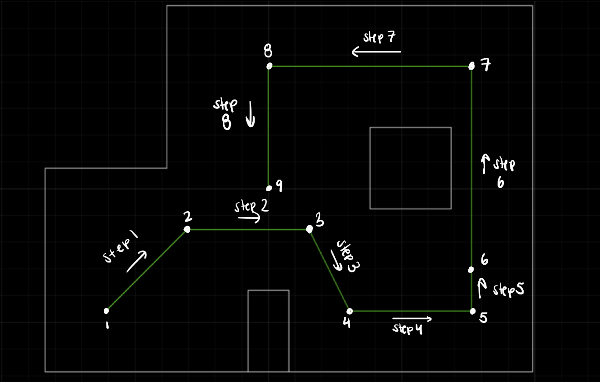
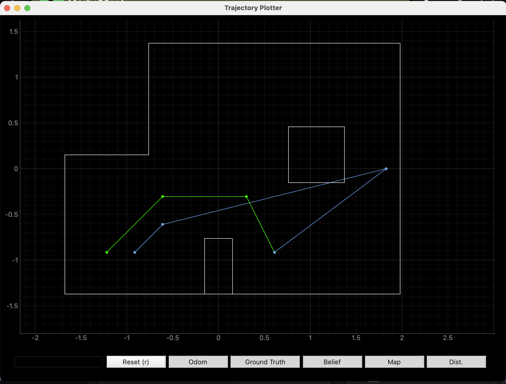

# Lab 12: Path Planning and Execution

## Open Loop Control 

To navigate through the map, I started with open loop control. I made 8 commands, MOVE_1 through MOVE_8, which each corresponded to a movement from one waypoint to the next. For example, MOVE_1 caused the robot to move from point 1 to 2, which required the robot to turn left 45 degrees and then move forward approximately 2.8 feet. The map below shows the trajectory of the robot for each of the commands.  

 

 

The code for MOVE_1 through MOVE_8 can be seen below. 

<pre><code class="language-cpp">
case MOVE_1:
delay(1000);
//turn left 45 deg 
analogWrite(1, 0);
analogWrite(5, 0);
delay(2);
analogWrite(2, right_PWM*1.3); //right wheel forward
analogWrite(0, left_PWM*1.3); //left wheel backward
delay(turn_time);
analogWrite(2, 0);
analogWrite(0, 0);
delay(50);
//move forward
analogWrite(1, left_PWM); //left wheel forward
analogWrite(2, right_PWM); //right wheel forward
delay(forward_time);
analogWrite(1, 0);
analogWrite(2, 0);
delay(15);
break;

case MOVE_2:
//turn right back to 0 deg, move to (1,-1)
delay(1000);
//turn left 45 deg 
analogWrite(2, 0);
analogWrite(0, 0);
delay(2);
analogWrite(5, right_PWM*1.3); //right wheel backward
analogWrite(1, left_PWM*1.3); //left wheel forward
delay(turn_time);
analogWrite(5, 0);
analogWrite(0, 0);
delay(100);
//move forward
analogWrite(1, left_PWM); //left wheel forward
analogWrite(2, right_PWM); //right wheel forward
delay(forward_time);
analogWrite(1, 0);
analogWrite(2, 0);
delay(15);
break;

case MOVE_3:
//turn right to -45 deg and move to (2, -3)
delay(1000);
//turn left 45 deg 
analogWrite(2, 0);
analogWrite(0, 0);
delay(2);
analogWrite(5, right_PWM*1.3); //right wheel backward
analogWrite(1, left_PWM*1.3); //left wheel forward
delay(turn_time);
analogWrite(5, 0);
analogWrite(0, 0);
delay(100);
//move forward
analogWrite(1, left_PWM); //left wheel forward
analogWrite(2, right_PWM); //right wheel forward
delay(forward_time);
analogWrite(1, 0);
analogWrite(2, 0);
delay(15);
break;

case MOVE_4:
//turn back to 0 deg and move to (5, -3)
delay(1000);
//turn left 45 deg 
analogWrite(1, 0);
analogWrite(5, 0);
delay(2);
analogWrite(2, right_PWM*1.3); //right wheel forward
analogWrite(0, left_PWM*1.3); //left wheel backward
delay(turn_time);
analogWrite(2, 0);
analogWrite(0, 0);
delay(50);
//move forward
analogWrite(1, left_PWM); //left wheel forward
analogWrite(2, right_PWM); //right wheel forward
delay(forward_time);
analogWrite(1, 0);
analogWrite(2, 0);
delay(15);
break;

case MOVE_5:
//turn left to 90 degrees and move to (5, -2)
delay(1000);
//turn left 45 deg 
analogWrite(1, 0);
analogWrite(5, 0);
delay(2);
analogWrite(2, right_PWM*1.3); //right wheel forward
analogWrite(0, left_PWM*1.3); //left wheel backward
delay(turn_time);
analogWrite(2, 0);
analogWrite(0, 0);
delay(50);
//move forward
analogWrite(1, left_PWM); //left wheel forward
analogWrite(2, right_PWM); //right wheel forward
delay(forward_time);
analogWrite(1, 0);
analogWrite(2, 0);
delay(15);
break;

case MOVE_6: 
//move forward to (5, 3)
analogWrite(1, left_PWM); //left wheel forward
analogWrite(2, right_PWM); //right wheel forward
delay(forward_time);
analogWrite(1, 0);
analogWrite(2, 0);
delay(15);
break;

case MOVE_7:
//turn left to 180 deg and move to (0, 3)
delay(1000);
//turn left 90 deg 
analogWrite(1, 0);
analogWrite(5, 0);
delay(2);
analogWrite(2, right_PWM*1.3); //right wheel forward
analogWrite(0, left_PWM*1.3); //left wheel backward
delay(turn_time);
analogWrite(2, 0);
analogWrite(0, 0);
delay(50);
//move forward
analogWrite(1, left_PWM); //left wheel forward
analogWrite(2, right_PWM); //right wheel forward
delay(forward_time);
analogWrite(1, 0);
analogWrite(2, 0);
delay(15);
break;

case MOVE_8:
//turn left to 270 deg and move to (0,0)
//turn left to 180 deg and move to (0, 3)
delay(1000);
//turn left 90 deg 
analogWrite(1, 0);
analogWrite(5, 0);
delay(2);
analogWrite(2, right_PWM*1.3); //right wheel forward
analogWrite(0, left_PWM*1.3); //left wheel backward
delay(turn_time);
analogWrite(2, 0);
analogWrite(0, 0);
delay(50);
//move forward
analogWrite(1, left_PWM); //left wheel forward
analogWrite(2, right_PWM); //right wheel forward
delay(forward_time);
analogWrite(1, 0);
analogWrite(2, 0);
delay(15);
break;
</code></pre>

As seen in the command code above, the delays were not hardcoded. Instead, I created the CHANGE_DELAY command, shown below, in order to easily change the delays via bluetooth while testing my robot in the map. 

<pre><code class="language-cpp">
case CHANGE_DELAY:
int change_for_delay, change_turn_delay;
  success = robot_cmd.get_next_value(change_for_delay);
  //Serial.println(right_PWM);
  if (!success)
    return;
  success = robot_cmd.get_next_value(change_turn_delay);
  if (!success)
    return;
  forward_time = change_for_delay;
  turn_time = change_turn_delay;
  //Serial.println(right_PWM);
  // Serial.println(right_PWM);
break;
 }
}
</code></pre>

After testing each leg of the robot's journey through the map, I found numerical values for the delay times that worked the best. The resulting Jupyter lab code is shown below. 

For 1 -> 2

<pre><code class="language-python">
#First move from (-4, -3) to (-2, -1)
ble.send_command(CMD.CHANGE_DELAY, "500|230")
time.sleep(2)
ble.send_command(CMD.MOVE_1, "")
</code></pre>

For 2 -> 3

<pre><code class="language-python">
#Second move from (-2, -1) to (1,-1)
ble.send_command(CMD.CHANGE_DELAY, "500|190")
time.sleep(2)
ble.send_command(CMD.MOVE_2, "")
</code></pre>

For 3 -> 4

<pre><code class="language-python">
#Third move from (1, -1) to (2,-3)
ble.send_command(CMD.CHANGE_DELAY, "500|190")
time.sleep(2)
ble.send_command(CMD.MOVE_3, "")
</code></pre>

For 4 -> 5

<pre><code class="language-python">
#Fourth move from (2, -3) to (5,-3)
ble.send_command(CMD.CHANGE_DELAY, "600|230")
time.sleep(2)
ble.send_command(CMD.MOVE_4, "")
</code></pre>

For 5 -> 6

<pre><code class="language-python">
#Fifth move from (5, -3) to (5,-2)
ble.send_command(CMD.CHANGE_DELAY, "350|350")
time.sleep(2)
ble.send_command(CMD.MOVE_5, "")
</code></pre>

For 6 -> 7

<pre><code class="language-python">
#Sixth move from (5, -2) to (5,3)
ble.send_command(CMD.CHANGE_DELAY, "1000|360")
time.sleep(2)
ble.send_command(CMD.MOVE_6, "")
</code></pre>

For 7 -> 8

<pre><code class="language-python">
#Seventh move from (5, 3) to (0, 3)
ble.send_command(CMD.CHANGE_DELAY, "800|300")
time.sleep(2)
ble.send_command(CMD.MOVE_7, "")
</code></pre>

For 8 -> 9

<pre><code class="language-python">
#Eighth move from (0, 3) to (0, 0)
ble.send_command(CMD.CHANGE_DELAY, "500|300")
time.sleep(2)
ble.send_command(CMD.MOVE_7, "")
</code></pre>

The robot performed two trials of map navigation using open loop control relatively well, as shown in the videos below. However, there was some variation in execution from one waypoint to the next between trials, likely due to the difference in battery charge, among other factors. In trial 1, MOVE_1, MOVE_5, MOVE_6, and MOVE_8 were executed properly. Based off the results from trial 2, I adjusted the delays slightly for trial 2. This helped, as it led to better execution of MOVE_2, MOVE_4, and MOVE_7 (on its second attempt), in addition to the proper addition of 1, 5, 6, and 8 as in trial 1. 

<iframe width="560" height="315" src="https://www.youtube.com/embed/ctVB6mVSDsY?si=BA80lxj5FCQu-z_5" title="YouTube video player" frameborder="0" allow="accelerometer; autoplay; clipboard-write; encrypted-media; gyroscope; picture-in-picture; web-share" referrerpolicy="strict-origin-when-cross-origin" allowfullscreen></iframe> <iframe width="560" height="315" src="https://www.youtube.com/embed/yOzfroauUeA?si=a0ElzBK5g3_XrXbS" title="YouTube video player" frameborder="0" allow="accelerometer; autoplay; clipboard-write; encrypted-media; gyroscope; picture-in-picture; web-share" referrerpolicy="strict-origin-when-cross-origin" allowfullscreen></iframe>

 

I thought about combining all these commands into one so that the robot would move more continuously through the environment. However, I was having Bluetooth issues, as detailed below in the "Bluetooth Issues" section under the discussion, so I thought it would be better to keep the commands separate. This allowed me to reconnect the robot when necessary (as was required after MOVE_3 and MOVE_6 in trial 2).

## Open Loop with Localization

Once I had verified that my open loop commands allowed the robot to move through the map properly, I decided to add a localization step in between each leg of the robot's journey. If both the localization and open loop commands were executed properly, the combination of the two would allow the robot to move autonomously through the environment. The main python loop to execute the path navigation is shown below. 

<pre><code class="language-python">
import asyncio
import time
import nest_asyncio
nest_asyncio.apply()

i = 0
run = True
while i <= 8 and run:
    
    # Get Observation Data by executing a 360 degree rotation motion
    loc.get_observation_data()

    # Run Update Step
    loc.update_step()
    loc.plot_update_step_data(plot_data=True)

    # Extract estimated pose from localization object
    argmax_bel = get_max(loc.bel)
    estimated_pose = loc.mapper.from_map(*argmax_bel[0])  # (x, y, theta)

    # Prompt user for true position
    true_x = float(input("Enter the true X position: "))
    true_y = float(input("Enter the true Y position: "))

    x_met = 0.3048*true_x
    y_met = 0.3048*true_y

    # Print comparison
    print(f"\nEstimated position: ({estimated_pose[0]:.2f}, {estimated_pose[1]:.2f})")
    print(f"True position:      ({x_met:.2f}, {y_met:.2f})")

    cmdr.plot_gt(x_met, y_met)

    err_x = abs(x_met-estimated_pose[0])
    err_y = abs(y_met - estimated_pose[1])

    if err_x < 0.1 and err_y < 0.1:
        i+=1
        move_to_next(i)
        await asyncio.sleep(15)
        LOG.info('Move done')
    else:
        act_pos = int(input("Is the robot in the right place? (0 for no, 1 for yes): "))
        if(act_pos == 0):
            run = False
        else:
            i+=1
            move_to_next(i)
            await asyncio.sleep(15)
            LOG.info('Move done')
</code></pre>

This loop runs 8 times, once for each desired step through the map. Since my localization was not always entirely accurate, I added in user input that prompts for the desired location (where it should be after taking each step). Based off this input, the loop then calculates whether it is in the right place based on its localization. If it was in the right location, it moves on immediately to the next step, which occurs in the 4th step in the video below. If not, there is again user prompting to check if it should still proceed with the navigation (aka the localization was incorrect but the previous step to the current location occurred correctly. 

In order to move forward to the next location, the loop calls the function move_to_next(), shown below, which consists of all the open loop functions used above. 

<pre><code class="language-python">
def move_to_next (i):
    import time
    import asyncio 
    ble.send_command(CMD.SET_PWMS, "140| 145")

    if i == 1:
        #First move from (-4, -3) to (-2, -1)
        ble.send_command(CMD.CHANGE_DELAY, "500|180")
        asyncio.run(asyncio.sleep(2))        
        ble.send_command(CMD.MOVE_1, "")
    if i == 2: 
        #Second move from (-2, -1) to (1,-1)
        ble.send_command(CMD.CHANGE_DELAY, "500|190")
        asyncio.run(asyncio.sleep(2))   
        ble.send_command(CMD.MOVE_2, "")
    if i == 3:
        #Third move from (1, -1) to (2,-3)
        ble.send_command(CMD.CHANGE_DELAY, "500|190")
        asyncio.run(asyncio.sleep(2))   
        ble.send_command(CMD.MOVE_3, "")
    if i == 4:
        #Fourth move from (2, -3) to (5,-3)
        ble.send_command(CMD.CHANGE_DELAY, "600|230")
        asyncio.run(asyncio.sleep(2))      
        ble.send_command(CMD.MOVE_4, "")
    if i == 5:
        #Fifth move from (5, -3) to (5,-2)
        ble.send_command(CMD.CHANGE_DELAY, "350|350")
        asyncio.run(asyncio.sleep(2))      
        ble.send_command(CMD.MOVE_5, "")
    if i == 6:
        #Sixth move from (5, -2) to (5,3)
        ble.send_command(CMD.CHANGE_DELAY, "1000|360")
        asyncio.run(asyncio.sleep(2))      
        ble.send_command(CMD.MOVE_6, "")
    if i == 7: 
        #Seventh move from (5, 3) to (0, 3)
        ble.send_command(CMD.CHANGE_DELAY, "800|300")
        asyncio.run(asyncio.sleep(2))      
        ble.send_command(CMD.MOVE_7, "")
    if i == 8:
        #Eighth move from (0, 3) to (0, 0)
        ble.send_command(CMD.CHANGE_DELAY, "500|300")
        asyncio.run(asyncio.sleep(2))      
        ble.send_command(CMD.MOVE_7, "")
</code></pre>

The video embedded below shows my best attempt at utilizing this navigation method. I have also included the corresponding map with the points calculated using localization (blue) and the real locations (green). As you can see, the localization worked quite well, except at point 3. This deviation was my fault, as after repositioning the robot, I forgot to move back out of the way, which messed up the localization at that point. Localization at point 4 worked perfectly, and as a result the robot headed straight to point 5! This is evident in the video, as you can see there is no user input (entering either 0 or 1) required to tell the robot to move from waypoint 4 to 5. This demonstrated that if I could get my localization to work perfectly every time, the robot would be able to move around the map autonomously. Unfortunately, after completing the step from point 4 to 5, the robot disconnected, so I was unable to finish the run. 

<iframe width="560" height="315" src="https://www.youtube.com/embed/tczammNKgHs?si=faKFn2r7jgZWyCwM" title="YouTube video player" frameborder="0" allow="accelerometer; autoplay; clipboard-write; encrypted-media; gyroscope; picture-in-picture; web-share" referrerpolicy="strict-origin-when-cross-origin" allowfullscreen></iframe>

 

 

 

In the video, you can see that I had to reposition the robot at each point This was because when writing the code I forgot to account for the fact that the robot needs to be at 0 degrees before starting the localization. So, after stepping from each waypoint to the next, I had to readjust the robot to face 0 degrees, then place it back to its original angle after localization was completed. I fixed this in my code after this trial, but due to the aformentioned Bluetooth difficulties, I was not able to get a more successful run than the one shown. 

## Discussion

Overall, although my open loop control did work, it took a lot of tuning, and varied greatly depending on the battery level. Adding localization for some sort of feedback worked, as when done correctly, it allowed the robot to recognize that it was in the correct place and should therefore keep moving. If I had more time and my localization worked perfectly each time, I would have added some sort of feedback to correct the robot's position if it did not make it to the correct waypoint. 

### PID Control

Another option that might have worked better than my open loop control with localization is PID control. This would have consisted of applying lab 5 (Linear PID) and 6 (Orientation PID) concepts in order to move throughout the environment. Using linear PID, the robot could move forward until it is a certain distance from a wall. In order to do this effectively, I would have changed the trajectory in order to more accurately detect walls. This ideal trajectory is shown in the image below. Orientation PID control could be used by detecting the original angle, and using the DMP to move in the desired direction from each point to the next. 

 

 

### Bluetooth Issues

As mentioned above, I had significant Bluetooth issues while trying to complete this lab. When attempting the flip during the ECE showcase, I managed to short circuit my Artemis. As a result, I had to resolder it to complete this lab. So, when I started having Bluetooth issues, I assumed it was because of the Artemis. I re-did some of my connections in order to try to fix the issue while in lab. However, after leaving lab I realized that the battery powering my Artemis was likely no longer holding charge. By the time I realized this, though, open hours were closed. So, I had to do all tests with my Artemis connected to my computer in an attempt to keep it powered. This worked for short periods of time, but as shown in the open loop with localization trial, the Artemis would still disconnect after some time with no explanation (aka it did not hit a wall or go further than the length of my cord). For further demonstration of the Bluetooth issues, I have a video showing how long it took for my Artemis to connect to my computer (approximately 25 seconds).

<iframe width="560" height="315" src="https://www.youtube.com/embed/O4pUxaCajq4?si=RWQ9uvzytQLCoxl0" title="YouTube video player" frameborder="0" allow="accelerometer; autoplay; clipboard-write; encrypted-media; gyroscope; picture-in-picture; web-share" referrerpolicy="strict-origin-when-cross-origin" allowfullscreen></iframe>

 

