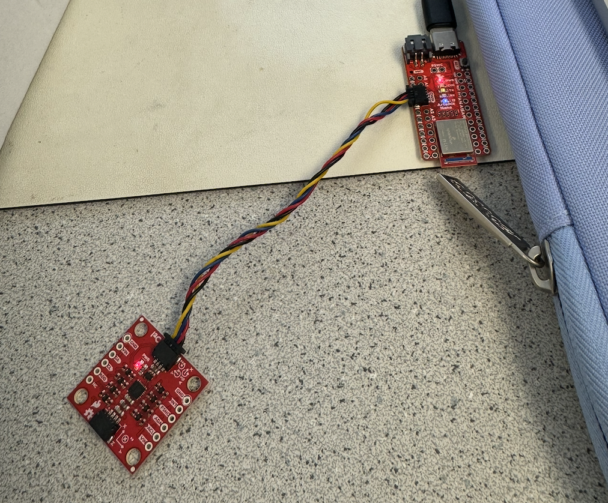

# Lab 2

## Task 1: IMU Setup

First, I connected the IMU to the Artemis board, as shown below, using QWIIC connectors. 

 

In order to interact with the IMU, I installed the “SparkFun 9DOF IMU Breakout_ICM 20948_Arduino Library.” After the library was installed, I ran the Example1_Basics file from the library to get the output shown in the video below. In the script, I kept AD0_VAL defined as 1, because the AD0 pin on the IMU is not connected to the ADR (address) based off the Sparkfun schematic provided. So, since the loop is not closed, the value should remain the default, 1. 

<iframe width="560" height="315" src="https://www.youtube.com/embed/yLPr0NABWfo?si=_Kv3WqxDgtZNJuPX" title="YouTube video player" frameborder="0" allow="accelerometer; autoplay; clipboard-write; encrypted-media; gyroscope; picture-in-picture; web-share" referrerpolicy="strict-origin-when-cross-origin" allowfullscreen></iframe>

 

As seen in the video above, the accelerometer and gyroscope values are changing as the IMU is being rotated about its 3 axes. Later in this lab I will further explain the behavior that is occurring, especially as I analyze the accelerometer's pitch and roll values in Task 2. 

## Task 2: Accelerometer

### Accelerometer Accuracy 

I was able to calculate the pitch and roll from the accelerometer output. I used the equations shown below, which were given in class. 

ADD IN SCREENSHOT

The following video shows the accelerometer output as the IMU is positioned at pitch angles of 0, 90, and then -90 degrees. I used the edges of the desk to get the most accurate measurements possible. The accelerometer pitch values were quite accurate, not differing more than about 4 degrees from the expected values. 

ADD IN PITCH VALUES VIDEO

In addition, I tested the accuracy of the accelerometer roll angles. The video below shows the accelerometer output at roll angles of 0, -90, and then 90 degrees. Similar to before, the values were quite accurate, differing no more than about 5 degrees from the expected angles. The rapid change in values occuring on screen happens when I reposition the IMU, which was unfortunately done off screen for part of the video.

ADD IN ROLL VALUES VIDEO 

Since I found the accelerometer output values to be quite accurate, as explained above, I did not think it was necessary to perform a two-point calibration.

### Noise in the Data

Even when the IMU is stationary, flat against my desk, there is noise present in the system. This noise can be seen in the graph below of roll and pitch graphed over time. Although both values are centered around 0, the measurements vary by about 1.5 degrees. Even a discrepancy this small could lead to further error propogation down the line. 

STATIONARY NOISE PIC

### Fourier Transform

In order to reduce noise in the accelerometer output, a low pass filter can be applied to the data. First, however, the frequency cutoff value needs to be determined. In order to determine the ideal frequency cutoff, I performed a Fourier Transform of both the roll and pitch data. I used the equations shown below to calculate the Fourier Transform.

  FOURIER TRANSFORM EQUATIONS

To test a system with a greater prevalence of noise, I gently hit the table while the accelerometer was collecting data. This created more vibrations in the system. The resulting pitch and roll output can be seen below.

PITCH ROLL VIBRATION PIC

After inducing this increased vibration, I generated the following plots, which display the Fourier Transforms of pitch and roll. On top, the full Fourier Transform plots are displayed. Below displays only a zoomed in portion of the plots. These sections were used to determine the frequency cutoff value.  

PITCH ROLL FOURIER TRANSFORM PLOTS (FUll and zoomed)

Based off the Fourier Transform plots, I chose my frequency cutoff value to be 8 Hz. Most of the significant data appears to occur at or below this frequency in both the plots of pitch and roll. 

### Low Pass Filter

Using my chosen frequency cutoff of 8 Hz, I implemented a lowpass filter on my accelerometer data. Using the equations given in lecture, I calculated an alpha value of 0.52. The equations I used are displayed below. Note that this alpha value was a bit high, due in part to my low sample rate of 45.5 samples/second. My sample rate was low due to delays and a print statement I implemented in order to better control the type of roll and pitch data I was collecting during testing. I will touch upon the impacts of increasing this sample rate more in tasks 3 and 4. 

ADD IN ALPHA Calc PICTURE

I first implemented the lowpass filter in Jupyter lab, seen below. I later added it to my Arduino code in order to calculate the complementary filter, discussed in Task 3. 

ADD LOWPASS FILTER CODE

The lowpass filter was applied to the same tabletop vibration data that I used to determine the frequency cutoff. The results are shown below. The lowpass filter successfully reduced the disturbance amplitude by approximately half for both the pitch and roll data. 

ADD LOWPASS ON TABLETOP PICS

In addition, I tested the lowpass filter on accelerometer output collected without a disturbance. The IMU was rotated from side to side in order to generate approximately sinusoidal outputs. The results are shown below.

ADD LOWPASS SINUSOIDAL GRAPHS

Although there was no large disturbance affecting the accelerometer in this case, the value of the lowpass filter is still evident. It helps to reduce noise, increasing the accuracy of the data.

## Task 3: Gyroscope

Using the equations from class, I was able to calculate pitch, roll, and yaw from the gyroscope data. I implemented the equations in Arduino using the code shown below. 

ADD IN GYRO CODE

I initially tested the gyroscope when it was sitting on my desk. The IMU was at a slight angle, which likely caused the continual increase in values shown in the left graph below. To test if sampling frequency would affect the gyroscope data, I removed the 20 milisecond delay I had in the gyroscope function. This increased sampling rate tenfold, and slightly improved the gyroscope output, as seen in the right graph below. The angle values are slightly more realistic when the sampling rate is increased, likely because a decrease in overall time prevents them from increasing too much. Note that the second time the gyroscope data was collected, the IMU was sitting at a different angle, which is why the roll angle increases rather than decreasing. 

ADD IN INITIAL GYRO GRAPHS

Since the accelerometer is more accurate than the gyroscope, but the gyroscope is less noisy than the accelerometer, it is a good idea to combine both to get the best output. This can be done using a complementary filter, the equation for which was given in lecture. I implemented the filter in Arduino, using the function shown below. 

ADD IN COMP CODE

I generated the graphs below to compare the gyroscope and accelerometer outputs to the output from the complementary filter. The data used in the top graphs was collected when the IMU was stationary, and the data in the bottom graphs was collected during rotation of the IMU. Unfortunately, I was not able to obtain the correct results for this portion of the lab. Ideally, the complementary filter would more closely match the values of the accelerometer, maintaining its accuracy while reducing noise due to the addition of the gyroscope component. 

ADD IN COMP GRAPHS  

## Task 4: Sample Data

As mentioned earlier in the lab, I started with a sample rate of only 45.5 samples/second during Task 2. This was because I had a delay in my Arduino code, which allowed me to generate sinusoidal data. When testing the gyroscope in Task 3, I removed the delay, and obtained a tenfold increase in the sample rate, bringing me to 455 samples/second. Although this is quite fast, none of the pitch or roll angles are the same. This means that the main loop does not run faster than the IMU produces new values. 

As in Lab 1, throughout all of Lab 2, I stored my values in arrays before sending them back to be received by the notification handler in Jupyter Notebook. For example, I have attached the code I used to send the accelerometer data to the computer below on the left. This data would then be received and processed by the notification handler, shown below on the right.

ADD THE ACCELEROMETER AND NOTIFICATION HANDLER

When I had a lower sampling rate of 44.5 samples/second I collected at least 5 seconds of data. This can be seen in my graphs above in Tasks 2. Once the sampling rate was increased to 445 samples/second, I only collected data for about 1 second, as my sample size was capped at 500 samples. In order to transition from one sample rate to the other, I only need to add a delay into my function, allowing me to capture at least 5 seconds worth of IMU data. Although I will not be sampling as quickly, I will still be receiving more than enough samples to properly measure the movement of the IMU. 

## Task 5: Record a Stunt

During lab, we also received our car. While driving it around, I first noticed that it was quite robust. It could be driven into walls with no damage, instead causing it to flip around, as seen below. This feature seems essential, though, since the car is not very good at driving straight. It tends to veer to either the right or the left. This makes it a bit harder to steer, so it is good that it will not get too damaged if it runs into something. 

ROBUST VIDEO

The stunt I performed was a frontflip. Driving the car forward quickly, then suddenly reversing caused it to completely flip over. This highlights the fact that it is able to drive on both sides, so the robot should not be in trouble if it flips over. 

BACKFLIP VIDEO

Resources: As mentioned, I refered to the Lecture Notes and the provided Lecture 4 code for the equations. In addition, I referenced Patty Meza's website from 2024 to better conceptually understand the Fourier Transform.

