# Lab 4: Motor Drivers and Open Loop Control

## Prelab

Before soldering my motor drivers, I drew the following wiring diagram. 

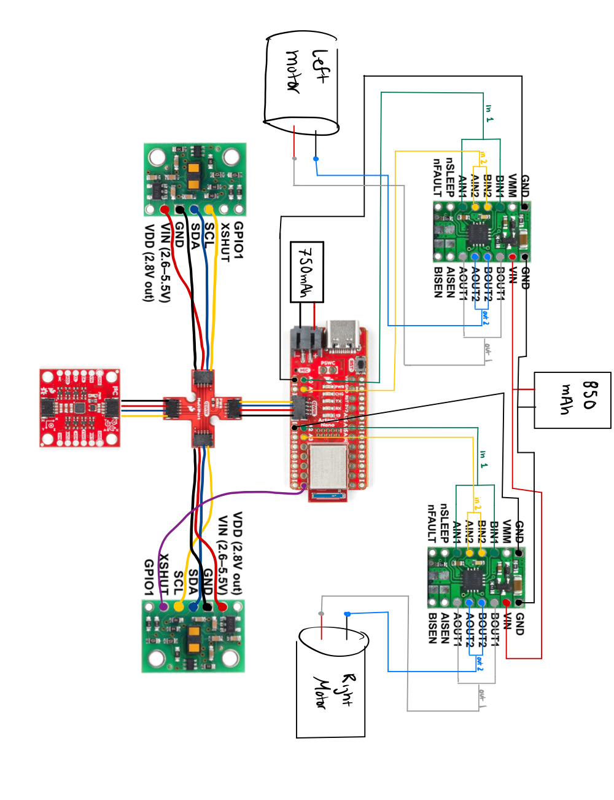

 

The motor driver and the Artemis use two different batteries. The motor drivers will be connected to the 850 mAh battery, while the Artemis is connected to the 750 mAh battery. The motor drivers use the higher mAh battery because they require a higher current to be drawn from the battery to ensure proper functionality. In addition, separating the batteries isolate the two components, allowing them to work without relying on the other. 

## Task 1: Motor Driver with Power Supply and Oscilloscope Hookup

After soldering my motor drivers, I hooked them up to the DC power supply and used the oscilloscope to check the inputs and outputs of the motor driver. Each pin was tested separately. The DC power supply was set to 3.7 volts. I decided on this voltage because it is same as that of the 850 mAh battery. The setup is shown in the picture below.

 

I used the following code in order to generate PWM signals. As you can see, for each motor driver, I set input 1 (pins 0 and 2) to 100, but I set input 2 (pins 1 and 3) to 200, double of input 1. The maximum is 255.

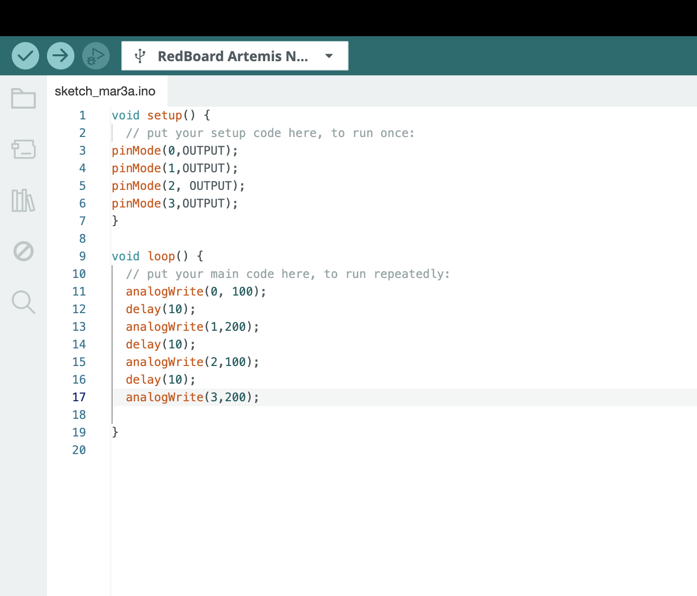

 

The following images show the signal generated by the input pins as a result of the code above. To the left is the PWM signal for input 1, and the PWM signal for input 2 is seen on the right. The oscilloscope settings are the same between the two signals, so it is evident that the duty cycle of input 1 is half that of input 2, corresponding to the values given to the pins in the code above. 

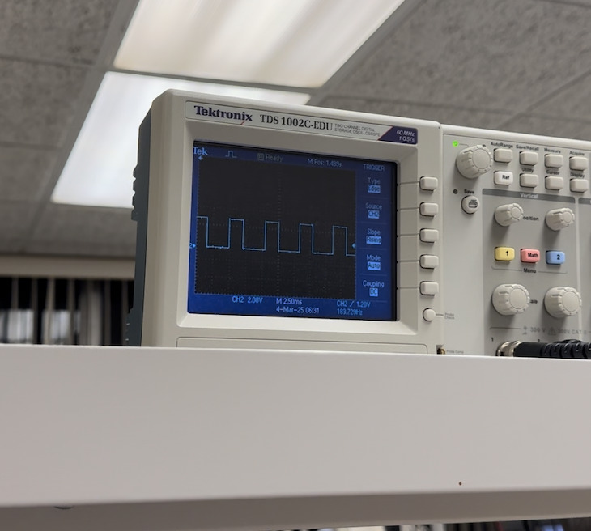 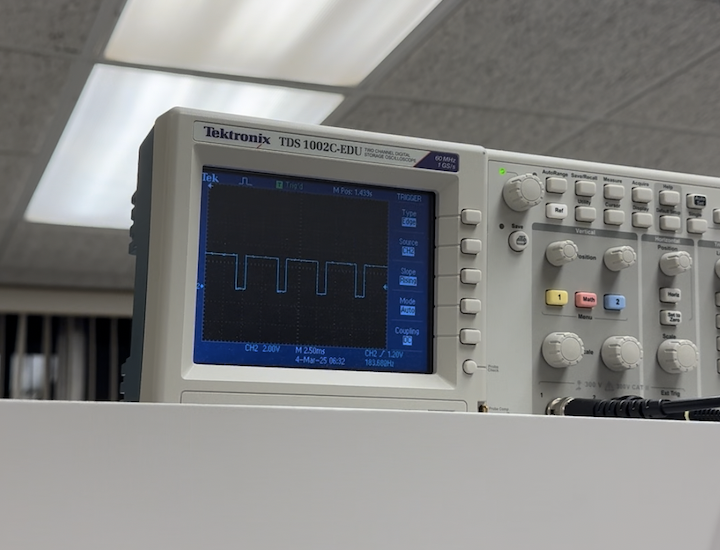

 

Then, I checked the signal being generated by the output pins. The signals are shown in the images below, output 1 on the left, and output 2 on the right. They exhibit the same behavior as the input that they correspond to. For example, the input 1 and output 1 both have a smaller duty cycle than input 2 and output 2. 

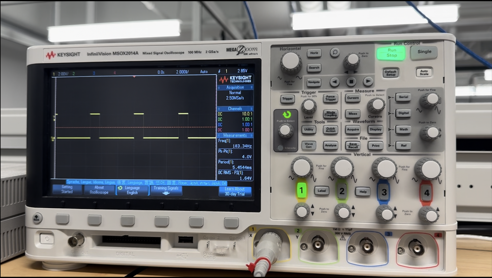 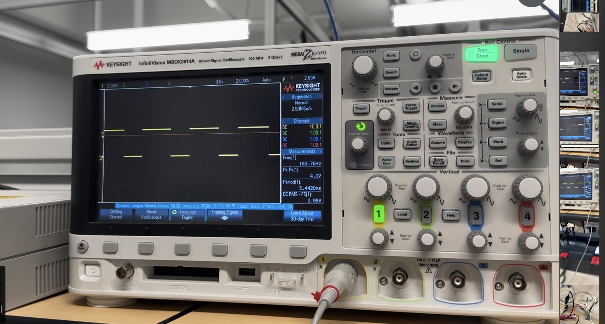

 

These oscilloscope outputs showed that varying the PWM value of the Artemis pins will change the duty cycle of the signal. This will in turn change the outputs on the motor driver, which allows me to regulate its power. 

## Task 2: Spin Left and Right Wheels Individually

After using the oscilloscope to show that the motor drivers were properly wired and that the signal could be varied, I connected the output pins of the motor drivers to the motors. The motor drivers remained powered by the DC power supply. In order to test whether the wheels could spin in both directions, I used the code seen below. For easier visualization, the left and right wheels were tested separately. 

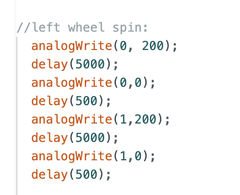 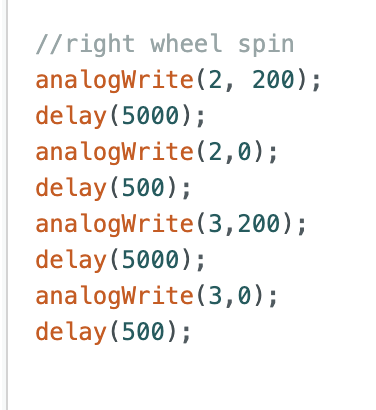

 

After the code shown above was uploaded, both the left and right wheels were able to run forward for 5 seconds, stop for a half second, run backward for 5 seconds, and repeat. The videos for the left and right wheels are shown below, respectively.

<iframe width="560" height="315" src="https://www.youtube.com/embed/hvVg1Nzj-Qg?si=Dv4Fnlbd8GPvJbXi" title="YouTube video player" frameborder="0" allow="accelerometer; autoplay; clipboard-write; encrypted-media; gyroscope; picture-in-picture; web-share" referrerpolicy="strict-origin-when-cross-origin" allowfullscreen></iframe> <iframe width="560" height="315" src="https://www.youtube.com/embed/LpIDKrMk7gk?si=AqKHl88fLMiRdbX0" title="YouTube video player" frameborder="0" allow="accelerometer; autoplay; clipboard-write; encrypted-media; gyroscope; picture-in-picture; web-share" referrerpolicy="strict-origin-when-cross-origin" allowfullscreen></iframe>

 

## Task 3: Power Motor Driver from 850 mAh Battery

Once I verified that the motor drivers were sucessfully able to control the wheels of the car, I connected the motor drivers to the 850 mAh battery. Using the same code as task 2, the battery was able to power both the left and right wheels. Videos demonstrating this for both the left and right wheels are seen below, respectively. 

<iframe width="560" height="315" src="https://www.youtube.com/embed/ytgQxG_3j0g?si=7ViOWgyx-1drUQDj" title="YouTube video player" frameborder="0" allow="accelerometer; autoplay; clipboard-write; encrypted-media; gyroscope; picture-in-picture; web-share" referrerpolicy="strict-origin-when-cross-origin" allowfullscreen></iframe> <iframe width="560" height="315" src="https://www.youtube.com/embed/YvkjAAA6_Ic?si=fFMDig2sonaTBwpz" title="YouTube video player" frameborder="0" allow="accelerometer; autoplay; clipboard-write; encrypted-media; gyroscope; picture-in-picture; web-share" referrerpolicy="strict-origin-when-cross-origin" allowfullscreen></iframe>

 

## Task 4: Installation of Components

For the purposes of this lab, only the Artemis, motor drivers, and batteries are needed. As seen below, I temporarily installed these components in the car to perform the next few tasks. In the future, I will also include the IMU and ToF sensors. In addition, the final installation will be much neater, with braided cables and zip ties to separate components. I unfortunately did not have access to zipties at the time of lab 4 completion, but I will be sure to incorporate them to clean up my installation as soon as possible. Although not ideal, my temporary installation held up very well for the tasks in this lab, since the car did not have to do more than move forward and spin.  

 

## Task 5: Lower Limit PWM Value 

Since these cars will move very fast at most PWM values, it is important to find their lower limit. This will allow the robot to be run at a "slower" pace when necessary. When testing from rest, I found the lower limit PWM values were 60 for the right wheels and 90 for the left wheels. These values allowed each side to overcome static friction and continue moving at a constant pace. However, the discrepancy between the values for the left and right wheels means that a calibration factor will have to be applied. 

## Task 6: Calibration Factor

As mentioned above, the discrepancy between the lower limit PWM values for each side requires implementation of a calibration factor to ensure the car will move forward in a straight line. This calibration factor was implemented as seen below. 

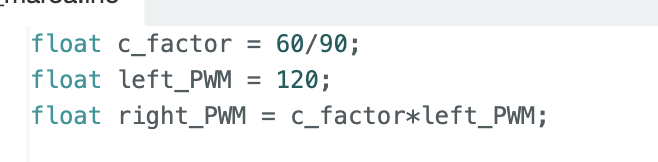

 

To test the calibration factor, the car was programmed to move forward in a straight line for 6 feet. The code that allowed it to do so can be seen below. 

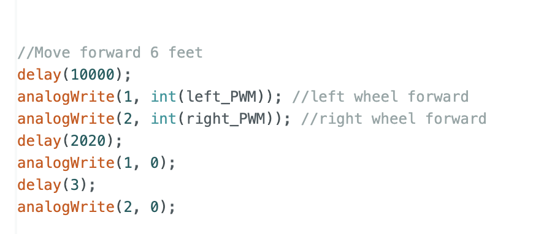

 

Using the calibration factor, the car was successfully able to travel straight for 6 feet, as seen in the video below. 

<iframe width="560" height="315" src="https://www.youtube.com/embed/FBLw1vH6DxE?si=kyGoboNnjrAzx2cU" title="YouTube video player" frameborder="0" allow="accelerometer; autoplay; clipboard-write; encrypted-media; gyroscope; picture-in-picture; web-share" referrerpolicy="strict-origin-when-cross-origin" allowfullscreen></iframe>

 

## Task 7: Open Loop Control

After verifying the calibration factor, I tested open loop, untethered control. I programmed the robot to move forward 6 feet, turn 180 degrees to the left, move back to the start and turn 180 degrees to the right. This would ideally bring the robot back to its starting position. The calibration factor was used to implement the turns, as seen in the picture below. 

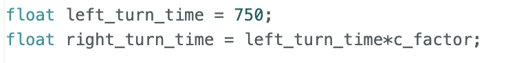

 

The full code used to implement the open loop control is shown below.

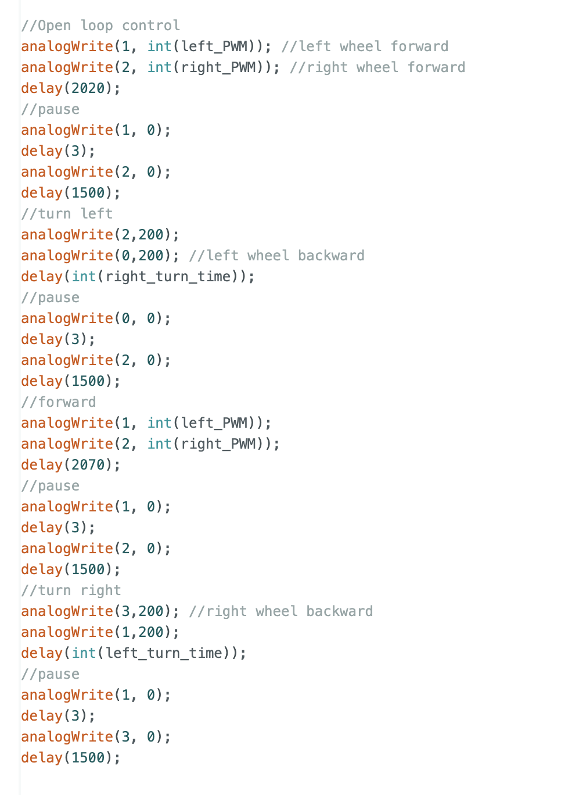

 

The open loop control was mostly successful. Two open loop trials can be seen below. Both used the code shown above. There were slight variations in robot behavior between trials, which I believe is partially due to the fact that my batteries were not fully charged. These variations emphasize the importance of utilizing sensor input to control the robot instead of relying on hard code. 

<iframe width="560" height="315" src="https://www.youtube.com/embed/9__vCb45jYU?si=ea2-5eiYW4HesVKk" title="YouTube video player" frameborder="0" allow="accelerometer; autoplay; clipboard-write; encrypted-media; gyroscope; picture-in-picture; web-share" referrerpolicy="strict-origin-when-cross-origin" allowfullscreen></iframe> <iframe width="560" height="315" src="https://www.youtube.com/embed/Jy8QcLcU9CI?si=qDgJl6LOryVfFViz" title="YouTube video player" frameborder="0" allow="accelerometer; autoplay; clipboard-write; encrypted-media; gyroscope; picture-in-picture; web-share" referrerpolicy="strict-origin-when-cross-origin" allowfullscreen></iframe>

 

## 5000 Level Tasks

### 1. analogWrite Frequency

As mentioned above in task 1, I tested two PWM values, 100 and 200. Please refer to the images in Task 1 for both the code used and the images of the oscilloscope measuring the output signals, which includes the frequency. For both PWM values, the oscilloscope measured a frequency of 183.7 Hz, or a sample every 5.4 ms. In Lab 3, I found that the ToF sensors collected 1197 samples in 10 seconds, or approximately 1 sample every 5 ms. Therefore, although manually configuring the timers would likely give you a smoother response from the motors, it seems unnecessary. Instead, it makes more sense to update the PWM values as data is received from the ToF sensors, especially since their sample rates are already very similar.

### 2. Lowest PWM Value - Speed Discussion 

In task 5, I found that the lower limit PWM values were 90 for the left wheels and 60 for the right wheels. These are the values required by the robot to overcome static friction. However, once moving, the robot no longer requires values quite as high. I found that the lowest values the robot can receive and still move forward are 80 for the left and 55 for the right wheels. The robot in motion at these values can be seen in the video below. 

<iframe width="560" height="315" src="https://www.youtube.com/embed/eu_zUO72bNI?si=PELbNEh0XYSpeylF" title="YouTube video player" frameborder="0" allow="accelerometer; autoplay; clipboard-write; encrypted-media; gyroscope; picture-in-picture; web-share" referrerpolicy="strict-origin-when-cross-origin" allowfullscreen></iframe>

 
