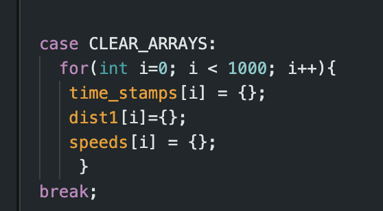
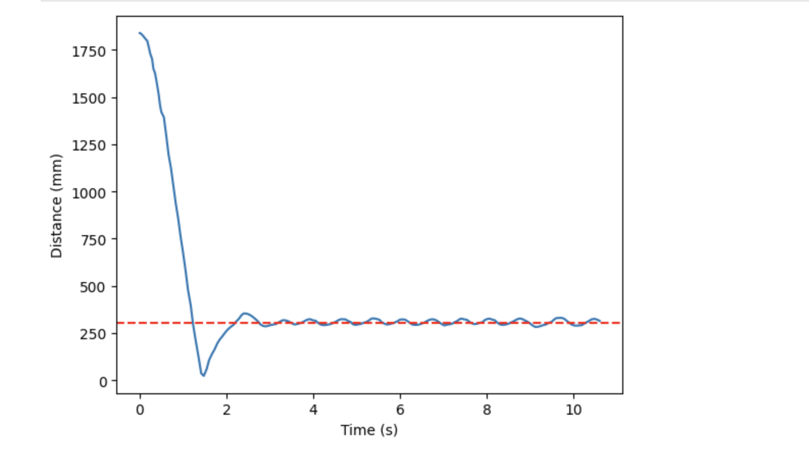
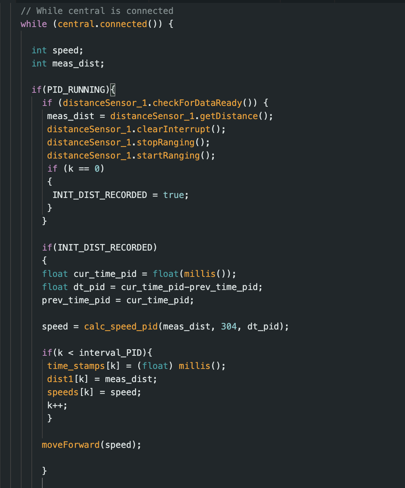

# Lab 5: Linear PID Control & Linear Interpolation

## Prelab

First, before starting on this lab, I rewired my car to make the electronics more compact. I made sure to keep the connections the same as before, but I cut the wires down significantly and organized them so that the motor drivers, arduino, and battery fit in the back of the car. I placed the TOF sensors on the front and back of the car, and placed the IMU at the front of the car on top. An image of the final version is shown below.

 

In addition, before I started to implement a PID controller, I had to make sure I had a good debugging system. In order to do this, I first created a new python script to allow the car to be controlled via Bluetooth. In python, I also edited my notification handler to receive the time, distance, and speed (PWM value) debugging data that would be collected from the robot. The data arrays were constrained to a length of 500 in Arduino to make sure the Artemis's internal RAM storage would not be surpassed.

To make my life easier when testing the robot, I implemented certain commands in Arduino, including EDIT_GAINS and CLEAR_ARRAYS. Both are shown below. The former allowed me to easily change the values of Kp, Ki, and Kd using a Bluetooth command. This made testing much easier, as I did not have to reupload new code each time I wanted to try new gain values. The latter cleared the values stored in the time, distance, and speed arrays. This was useful for tests when the robot did not run for long enough to record 500 values, as it prevented values from previous tests from being sent back to python for analysis. 

 

 

To have the robot start and stop as a result of Bluetooth input, I added a flag, PID_RUNNING. When PID_RUNNING is true, the code will execute, and the robot will begin to move using the PID controller. But, when the flag is false, the robot will be stationary. I implemented two commands in Arduino, BEGIN_PID and STOP_PID, shown below, which turn the flag on and off as a result of Bluetooth input. This made it very easy to control different test cases. 

 

 

## P Controller 

Initially, I just tested proportional control to make sure that my code functioned properly. The code I used to implement proportional control is shown below. 

 

The loop used in this code was dependent on the TOF sensor. Therefore the frequency was quite low, hovering around approximately 16 Hz. 

For simplicity, I also had a hard stop implemented, which had the robot stop if the calculated PWM value was between -10 and 10, as seen in the code below. This hard stop operated under the assumption that the robot should be close to the desired distane of 1 foot from the wall if when a PWM value this low is calculated.

 

Using this method, I was able to obtain the result shown below, where the robot hit the wall gently, reversed to approximately 1 foot, and then stopped. The Kp value used in this test was 0.15.

*** ADD VIDEO OF HARDSTOP P CONTROL *** 

The distance and speed graphs that resulted from this P control trial, where Kp = 0.15 can be seen below.

 

 

As you can see from the graphs above, the robot stopped at about 1 foot from the wall. However, we ideally want to see the robot stop at exactly 1 foot, or oscillate about that point. In order to get these oscillations, I commented out the code shown above that caused the hard stop. Instead, when the calculated speed (PWM values) got this low, they were adjusted so that they would be higher than the deadband PWM values found in Lab 4. The full code used to move the robot forward based on the calculated speed is shown below, which includes the deadband adjustment. 

 

Using this code, I again tested just a P controller at varying Kp values. I first tested Kp = 0.15 to see how the robot behavior would change with no hard stop. The video and corresponding speed and distance graphs are shown below. This value was too high, as the robot initially collided with the wall. However, it was able to reach a distance from the wall of 1 foot. Since there was no hard stop, it oscillated about this distance. 

*** ADD IN VIDEO FOR KP = .15 AND CORRESPONDING GRAPHS ***

 

 

I next tested Kp = 0.10, which did a better job than 0.15, as it prevented the robot from hitting the wall. It also allowed the robot to return back to the desired distance of 1 foot. However, the overshoot that resulted from this gain was still quite large. The corresponding videos and graphs can be seen below. 

*** ADD IN VIDEO FOR KP = .1 AND CORRESPONDING GRAPHS ***

 

 

In order to reduce overshoot, I again reduced the Kp value slightly, to 0.07. The resulting video and graphs are shown below. Reducing the gain was able to reduce overshoot, but the tradeoff was that robot speed as it advances towards the wall decreased. But, it was able to reach the desired distance just as effectively as the previous gains tested. As a result, when advancing to testing a PI, and later PID, controller, I kept Kp at 0.07 to keep speed at a reasonable pace, which in turn helped keep the overshoot small.

*** ADD IN VIDEO FOR KP = 0.07 AND CORRESPONDING GRAPHS ***

 

 

## PID Control 

Once I obtained ideal proportional gain behavior, I changed my code to incorporate both integral and derivative control when calculating the speed of my car. The corresponding Arduino code can be seen below. Adding integral control should reduce steady state error and derivative control will reduce overshoot. 

 

### Wind-Up Protection
When testing integral control, I quickly realized I needed windup protection. Even at extremely low Ki values, the robot would not slow down as it neared an object. My test for this can be seen in the video below. To prevent damage to my TOF sensor, I held onto the car as it neared the wall, since it would have hit the wall at a high speed if released.

*** ADD VIDEO DEMONSTRATING WHY WE NEED WINDUP PROTECTION ***

In order to implement wind-up protection, I added the following constraints, seen in the image below, into my speed (PWM value) calculation. Initally, I constrained the integrator term that contributes to the PWM value to positive or negative 100. However, once the robot moved halfway to the wall, I reduced this constraint to positive or negative 20. Otherwise, the robot would not slow down quickly enough to prevent it from running into the wall. 

 

### Decoupling PID Control from TOF Sensor

In addition, we were tasked with decoupling PID control from the TOF sensor. I did this by moving my variable initializations, calculations, and array storage out of TOF loop. In order to make sure that calculations would not occur before the TOF recorded it's first value, though, I created the flag, INIT_DIST_RECORDED. The resulting code is seen below.

 

Once the PID control was decoupled from the TOF loop, the frequency was much higher, at approximately 65 Hz. This is approximately quadruple the frequency of the TOF sensor readings. 

### PI Control Testing
After decoupling, I started testing PI control. After trying a variety of Ki values, I found that my robot performed best at gains of Kp = 0.07 and Ki = 1E-6. To show that these gains had the best performance, I conducted 3 repeated trials. The videos for these trials are shown below.

*** VIDEOS FOR 3 REPEATED TRIALS *** 

I combined the distance and speed data for all 3 trials into the graphs shown below. The first trial had the best performance, both in terms of overshoot and steady state error. This is likely because the battery was fully charged during this trial. The second and third trials had a slightly larger overshoot, but both eventually reached the ideal distance. The difference in end behavior, especially with regard to the amplitude of oscillations, demonstrates the importance of using a fully charged battery whenever possible. 

*** COMBINED PLOTS FOR ALL 3 TRIALS *** 

 

 

### Linear Speed 
From these plots, I obtained the maximum linear speed using these PI control gains. I found the slope of distance from 1 to 2 seconds, and got 634,
893, and 933 m/s for the respective trials. This gives an average linear speed of 820 for this PI control with Kp = 0.07 and Ki = 1E6.

### Extrapolation

Before I could start testing derivative control, I used data extrapolation to predict the distance the robot was from the wall based off the two previous measurements. Extrapolation increases accuracy as it gives an updated distance for each time PID control speed is calculated since the PID control loop executes faster than the TOF sensors. My edited code using extrapolation can be seen below. 

 

Each time the TOF sensor records a new value, x2 and t2 are set to x1 and t1, respectively. Then, x1 and t1 are updated to the current values. Then, when the sensor is not ready to measure a new value, an estimated distance can be calculated using the extrapolation equation. 

### PD Control Testing
After implementing extrapolation, I tested my PD control on my robot. I kept Ki = 0.07, the same as before, and tested Kd at 1, 2, and 3. I decided that a Kd value of 2 performed the best of the three. This was because it had a smaller overshoot value than Kd = 1, and its data was less noisy than that of Kd = 3. The video and corresponding graphs of PD control for Ki = 0.07 and Kd = 2 can be seen below.

*** PD Control Video AND graphs ***

 

 

During testing, I did not add anything into my code to combat derivative kick. Since the enviroment I was testing is was very stable, there were not any unexpected inputs that could translate to an unstable output. However, in future labs it would be beneficial to add something to combat derivative kick as I will likely be testing in more unpredictable environments. 

### PID Control Testing
Once I found an ideal Kd value, I decided to test my robot with PID control. When choosing gains, I kept Kp the same as before, 0.07, but I varied Ki within the range of 1E-6 and 1E-5 and Kd from 2 to 5. From my tests I found that the best PID controller had gains of Kp = 0.07, Ki = 7E-6, and Kd = 4. As seen in the graphs below, these gains resulted in a small overshoot, rapid decay, and very minimal steady state error. 

*** DESIRED PID VIDEO AND GRAPHS ***

 

 

### Changing Conditions
In order to show that my PD control was robust, I tested it at 1, 2, and 3 meters from the wall. In order to test at these distances, I first set the TOF sensor to the long distance mode. For all 3 tests, the gains were set to Kp = 0.07, Ki = 7E-6, and Kd = 4, the same as in the PID controller found above. Videos for all 3 tests are displayed below. I attempted to test at 4 meters as well, but the test failed, likely because the sensor could not adequately detect the wall, even in the long distance mode. 

*** VIDEOS FOR 1, 2, AND 3 METERS ***

### 5000 Level - Wind-Up Protection
As shown above, I had to implement wind-up protection. This is necessary because unlike the proportional or derivative control terms, the integral term compounds over time. Therefore, it is easy for the term to spiral out of control, especially as more time goes on. This is especially bad in the scenario we are testing, since as time goes on, we approach the wall, and desire a smaller term to calculate speed, not one that continually increases. See my section above for more information about how, exactly, I implemented protection. 

### Acknowledgements
I refered to Stefan's website in order to better understand how to combine proportional, integrator, and derivative control terms. I also refered to Mikayla's website for more information on wind up protection implementation and extrapolation. 
