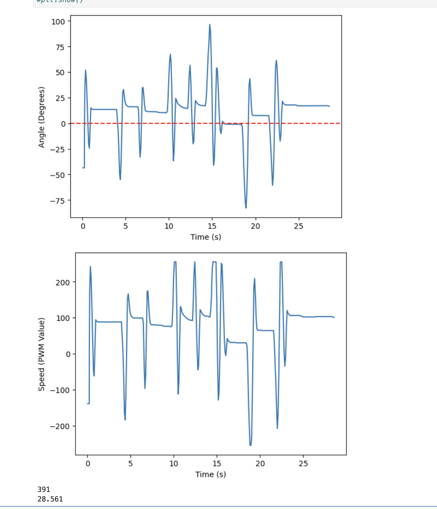

# Lab 6: Orientation Control 

## Prelab

As with Lab 5, I added a flag, PID_ORI_RUNNING, so that the robot could start and stop as a result of Bluetooth input. I created the cases BEGIN_ORI_PID and STOP_ORI_PID to turn the flag on and off. In addition, I continued to use the EDIT_GAINS case that I elaborated on in Lab 5, which made it much easier for me to test different gain values as I tested P and PI control.

## DMP SETUP 
In order to mimize yaw drift, I decided to use my IMU's onboard DMP. Following the instructions given in the "Digital Motion Processing for Orientation" handout, I first uncommented line 29 in CM_20948_C.h to define ICM_20948_USE_DMP. Then, I opened the example file Example7_DMP_Quat6_EulerAngles, and added the code shown below to my setup() function. 

 

I also added code from the example's loop() function to mine. This allowed me to record the orientation quaternions from the DMP while the robot was running. To convert the quaternions to the yaw angle, I created the function yaw_from_quat, which is seen below. I referred to the example Wikipedia code linked on the handout to create this function.

 

## PID Control

I implemented PID control similar to Lab 5, except using yaw angle instead of distance from the wall. I created the function shown below to calculate PWM speed based on the error in yaw angle. 

 

If the resulting PWM speed calculation was positive, the robot would respond by turning left. When the value was negative, the robot would turn right. This can be seen in the code snippet from my loop() function shown below. This code also shows how I recorded debugging data. I created a new case, SEND_SPEED_ANGLE, that would loop through the debugging data and send it from the robot to my computer after running each trial. 

 

### P Control

At first, I only tested proportional control in order to obtain ideal Kp values. I first started with Kp = 1, and obtained the results shown below.

<iframe width="560" height="315" src="https://www.youtube.com/embed/us0VqucYiV4?si=8KdP8JhlD_DwWttl" title="YouTube video player" frameborder="0" allow="accelerometer; autoplay; clipboard-write; encrypted-media; gyroscope; picture-in-picture; web-share" referrerpolicy="strict-origin-when-cross-origin" allowfullscreen></iframe>

 

 

As seen in the graphs above, the gain was not very effective at 1, as the angle hovered around 100 degrees, unable to reach the desired value of 1. So, in order to get a stronger response, I increased the gain until I got good results, which occurred when Kp was 4. The data and video for this trial can be seen below.

<iframe width="560" height="315" src="https://www.youtube.com/embed/quv7vDS2HMQ?si=zkpq5SPgH5fnErn8" title="YouTube video player" frameborder="0" allow="accelerometer; autoplay; clipboard-write; encrypted-media; gyroscope; picture-in-picture; web-share" referrerpolicy="strict-origin-when-cross-origin" allowfullscreen></iframe>

 

 

When Kp was increased to 4, the robot had a stronger response to the disturbance, causing larger oscillations. This stronger response also caused the steady state error to decrease significantly. 

### PI Control

Although increasing the Kp gain to 4 decreased the steady state error, it did not reach zero. In order to reach zero steady state error, I added in integral control. After testing a few values, I found that a Ki gain of 0.01 worked well, as seen below. 

<iframe width="560" height="315" src="https://www.youtube.com/embed/JR6Xzd_a9U8?si=1b-lpkiUnBZNt-2d" title="YouTube video player" frameborder="0" allow="accelerometer; autoplay; clipboard-write; encrypted-media; gyroscope; picture-in-picture; web-share" referrerpolicy="strict-origin-when-cross-origin" allowfullscreen></iframe>

 

 

As you can see in the plot of the angle over time, steady state error reached nearly zero once integral control was added. However, the trade-off was that the robot oscillated more than with only proportional control. 

### PID Control 

Adding integral control reduced steady state error significantly. However, as mentioned, it caused more oscillations that had larger overshoot. To reduce the overshoot and help the robot find the desired angle more quickly, I added in derivative control. For PID control, I kept Kp the same, 4, but I decreased Ki to 0.001 and increased Kd until I got the desired behavior. This occurred at Kd = 3. The corresponding plots and video of the final PID control are shown below.

<iframe width="560" height="315" src="https://www.youtube.com/embed/VeCb_-9J_Uc?si=F_iK_WJvq3ItQZpk" title="YouTube video player" frameborder="0" allow="accelerometer; autoplay; clipboard-write; encrypted-media; gyroscope; picture-in-picture; web-share" referrerpolicy="strict-origin-when-cross-origin" allowfullscreen></iframe>

 

 

### Sampling Time

For all of the trials done, the sampling rate was about 14 samples per second. So, the IMU's onboard DMP recorded a new value every 70 ms.

## 5000 Level: Wind-Up Implementation and Discussion 

Wind-up control is necessary to implement because unlike the proportional or derivative control terms, the integral term compounds over time. Therefore, it is easy for the term to spiral out of control, especially as more time goes on. The video below shows what happens when there is no wind-up protection, even for a Ki value as low as 0.005. 

<iframe width="560" height="315" src="https://www.youtube.com/embed/FHzhZpboorE?si=AaqErp620yDTZ5l1" title="YouTube video player" frameborder="0" allow="accelerometer; autoplay; clipboard-write; encrypted-media; gyroscope; picture-in-picture; web-share" referrerpolicy="strict-origin-when-cross-origin" allowfullscreen></iframe>

 

I implemented wind-up control by ensuring the integral term that contributes to the speed calculation could not exceed -100 or 100. The code for this is shown in the SPEED_CALC_ORI function above. This was the protection I used while testing my PI and PID control.

However, it is interesting to note that it is possible to implement too much protection. At one point, I limited the integral term to between -35 and 35. The change in the code is shown below. 

 

This prevented the robot from reaching zero steady state error, even when the Ki gain was as high as 0.2. This can be seen in the graphs below.

 

### Acknowledgements: 

I referenced Lulu's solution from this semester in order to better understand how to incorporate the DMP code into ble code. In addition, as mentioned above I took DMP code from the handout linked in Lab 6 and I referenced the Wikipedia code when creating my function to convert from quaternions to yaw angle. 
