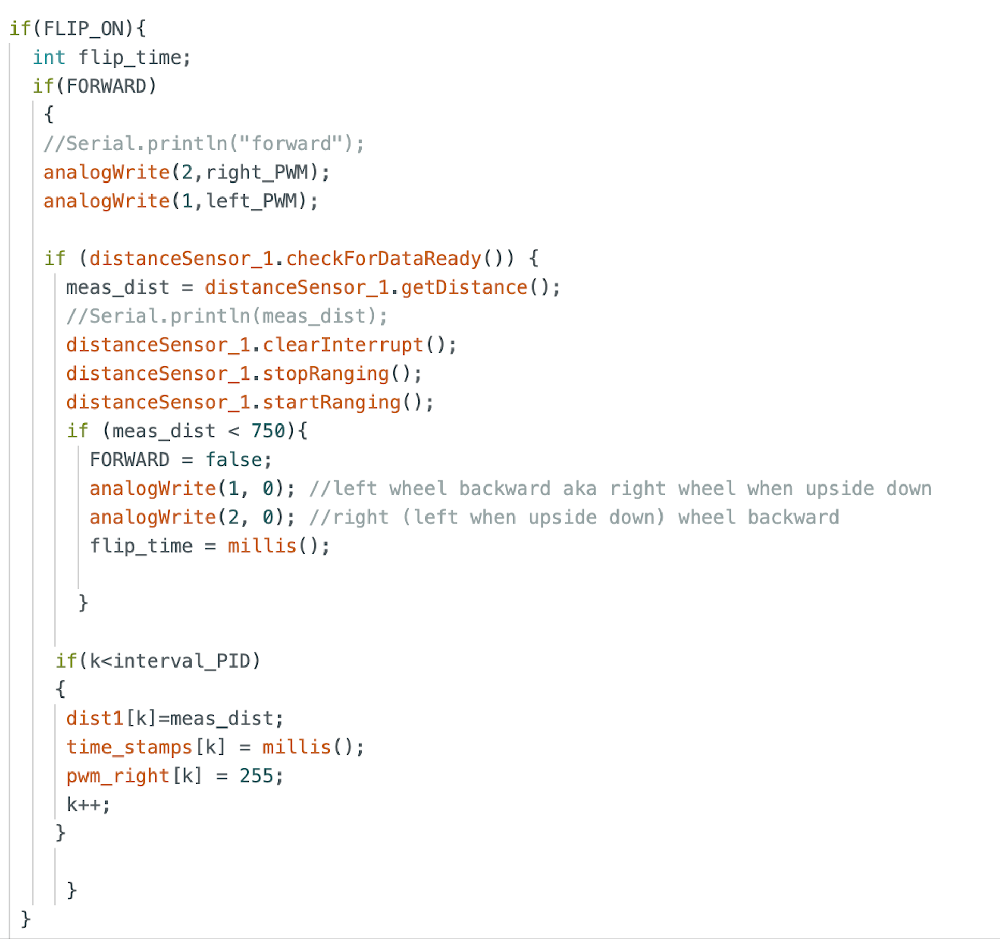

# Lab 8: Stunts

## Task A: Flip

I decided to perform the flip because I thought it would be more fun to implement and it looked cooler than the drift, in my opinion. As with previous labs, I added cases that would turn a flag, FLIP_ON, true or false. When FLIP_ON was activated, the robot would perform the flip based off the code shown in the image below. The robot first moved straight towards the wall at full speed until it reached the mat. Then, it reverses at full speed, causing it to flip. 

 

 

