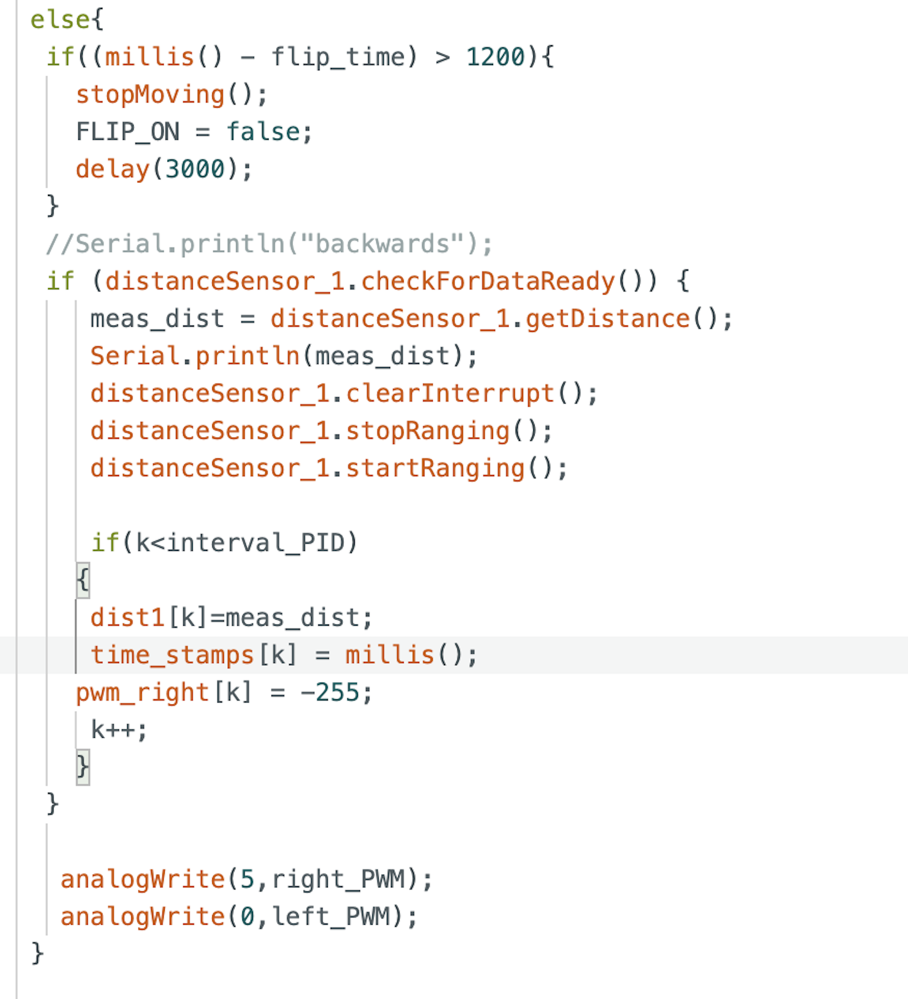

# Lab 8: Stunts

## Task A: Flip

I decided to perform the flip because I thought it would be more fun to implement and it looked cooler than the drift, in my opinion. As with previous labs, I added cases that would turn a flag, FLIP_ON, true or false. When FLIP_ON was activated, the robot would perform the flip based off the code shown in the image below. The code below has the robot first move straight towards the wall at full speed until it reaches the mat, which occurs when the distance sensor read 750 mm. Then, it reverses at full speed, causing it to flip. Once flipped, the robot should continue reversing until it reaches its starting point. 

 

 

After completing the code, I tested my robot at home before heading to Phillips to test on the sticky mat. Since my house is carpeted, I was not able to get the robot to flip, but it stopped at the correct distance from the wall and reversed straight back to its starting point. As it was just a test, I did not record the run, but luckily I did take a screenshot of the data, which can be seen below. 

*** ADD IN TEST DATA SCREENSHOT ***

Once I determined that my code worked as expected, I went to Phillips to test in an environment where a flip would be possible. Unfortunately, though, at the very beginning of my testing, I lost a wheel. My robot hit the wall at just the right angle for the plastic that connected the left rear wheel to the chassis to shear. In fact, it was so early in my testing for the night that I wasn't even recording (truly tragic because it would have made a great blooper at the very least). 

As a result, the best video I have of a flip at the moment is the following clip which shows my car performing a flip with only 3 wheels. It manages to drive forward in a relatively straight line toward the wall. It flips at the correct distance from the wall. However, due to the asymmetry, it drives parallel to the wall after the flip instead of directly back to the starting point. This results in a collision with the left wall which causes the robot to disconnect from my computer, so I could not even get the data from this test. 

### BEST FLIP (TRAGICALLY)

<iframe width="560" height="315" src="https://www.youtube.com/embed/vgn4ld5GuWw?si=7_uO_zuyNrx1grLX" title="YouTube video player" frameborder="0" allow="accelerometer; autoplay; clipboard-write; encrypted-media; gyroscope; picture-in-picture; web-share" referrerpolicy="strict-origin-when-cross-origin" allowfullscreen></iframe>

 

### BLOOPER REEL

As tragic as my night's events where, they did make for a pretty decent blooper reel compilation, which can be seen below. Make sure to turn your sound on :) 

