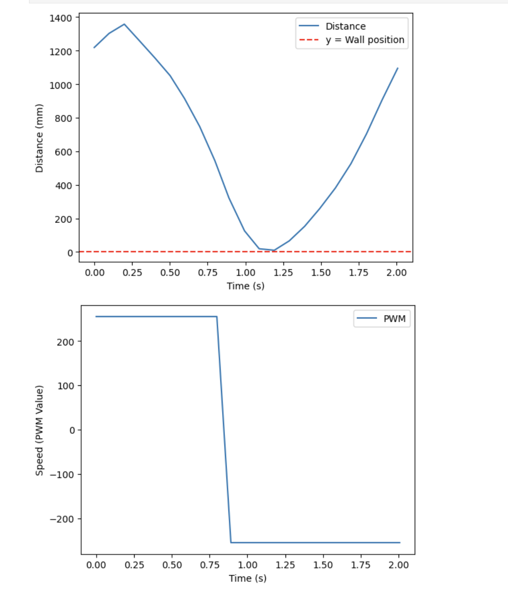

# Lab 8: Stunts

## Task A: Flip

I decided to perform the flip because I thought it would be more fun to implement and it looked cooler than the drift, in my opinion. As with previous labs, I added cases that would turn a flag, FLIP_ON, true or false. When FLIP_ON was activated, the robot would perform the flip based off the code shown in the image below. The code below has the robot first move straight towards the wall at full speed until it reaches the mat, which occurs when the distance sensor read 750 mm. Then, it reverses at full speed, causing it to flip. Once flipped, the robot should continue reversing until it reaches its starting point. 

 

 

 

After completing the code, I tested my robot at home before heading to Phillips to test on the sticky mat. Since my house is carpeted, I was not able to get the robot to flip, but it stopped at the correct distance from the wall and reversed straight back to its starting point. This result can be seen in the data shown below. 

 

Once I determined that my code worked as expected, I went to Phillips to test in an environment where a flip would be possible. Unfortunately, though, at the very beginning of my testing, I lost a wheel. My robot hit the wall at just the right angle for the plastic that connected the left rear wheel to the chassis to shear. In fact, it was so early in my testing for the night that I wasn't even recording (truly tragic because it would have made a great blooper at the very least). 

Even down a wheel, the robot was relatively stable, so I tried to see if a flip would still be possible. Espresso (my robot) made a valiant attempt, and successfully drove to the wall and flipped. However, due to the asymmetry, after landing the flip, it drove parallel to the wall instead of directly back to the starting point. The video of this three-wheeled flip can be seen below. After this test, I realized that I likely would not be able to get the proper results, so I went home to try to fix Espresso. My blooper reel, which is embedded at the end of this report, describes the tragic events of this night in more detail. 

### THREE WHEELED FLIP 

<iframe width="560" height="315" src="https://www.youtube.com/embed/vgn4ld5GuWw?si=7_uO_zuyNrx1grLX" title="YouTube video player" frameborder="0" allow="accelerometer; autoplay; clipboard-write; encrypted-media; gyroscope; picture-in-picture; web-share" referrerpolicy="strict-origin-when-cross-origin" allowfullscreen></iframe>

 

### FLIP VIDEOS 

Luckily, Jennie was kind enough to lend me her robot, Depresso, so that I could finish my Lab 8. I uploaded my code onto Depresso, and was able to get the flips shown in the videos below. The first flip shown was my best stunt, as it took only **0.8 seconds** for the robot to return to its starting point after completing the flip. The second flip took slightly longer, as it took approximately 1.4 seconds to return to the starting point. 

Unfortunately, the third flip shown below was a "failed" run since the robot did not make it back to the starting line. I would have performed more tests if I could, but I had to return Depresso to Jennie, and my robot was not in the proper state to do flips after I superglued the wheel back on. 

<iframe width="560" height="315" src="https://www.youtube.com/embed/Pw6JLYLke70?si=G_WnB0U1M7-bKZUl" title="YouTube video player" frameborder="0" allow="accelerometer; autoplay; clipboard-write; encrypted-media; gyroscope; picture-in-picture; web-share" referrerpolicy="strict-origin-when-cross-origin" allowfullscreen></iframe>

 

<iframe width="560" height="315" src="https://www.youtube.com/embed/xfJk16H_ywE?si=1qGiUywl_P6Zzt7E" title="YouTube video player" frameborder="0" allow="accelerometer; autoplay; clipboard-write; encrypted-media; gyroscope; picture-in-picture; web-share" referrerpolicy="strict-origin-when-cross-origin" allowfullscreen></iframe>

 

<iframe width="560" height="315" src="https://www.youtube.com/embed/aLCSiGhxWRw?si=moqJtgPQmDcvpwv7" title="YouTube video player" frameborder="0" allow="accelerometer; autoplay; clipboard-write; encrypted-media; gyroscope; picture-in-picture; web-share" referrerpolicy="strict-origin-when-cross-origin" allowfullscreen></iframe>

 

### FLIP DATA 

### BLOOPER REEL

As tragic as my night's events were, they did make for a pretty decent blooper reel compilation, which can be seen below. Make sure to turn your sound on :) 

<iframe width="560" height="315" src="https://www.youtube.com/embed/fg5IsR_bxE0?si=DBctev9gjghH2AnQ" title="YouTube video player" frameborder="0" allow="accelerometer; autoplay; clipboard-write; encrypted-media; gyroscope; picture-in-picture; web-share" referrerpolicy="strict-origin-when-cross-origin" allowfullscreen></iframe>

 

