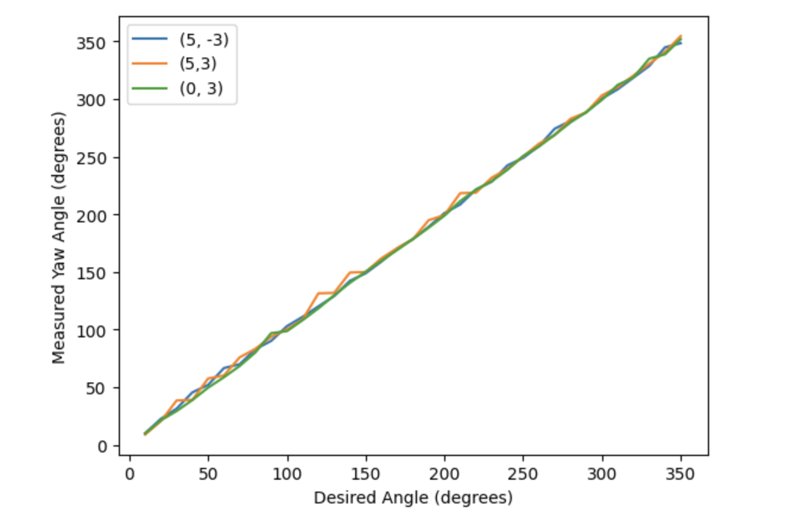
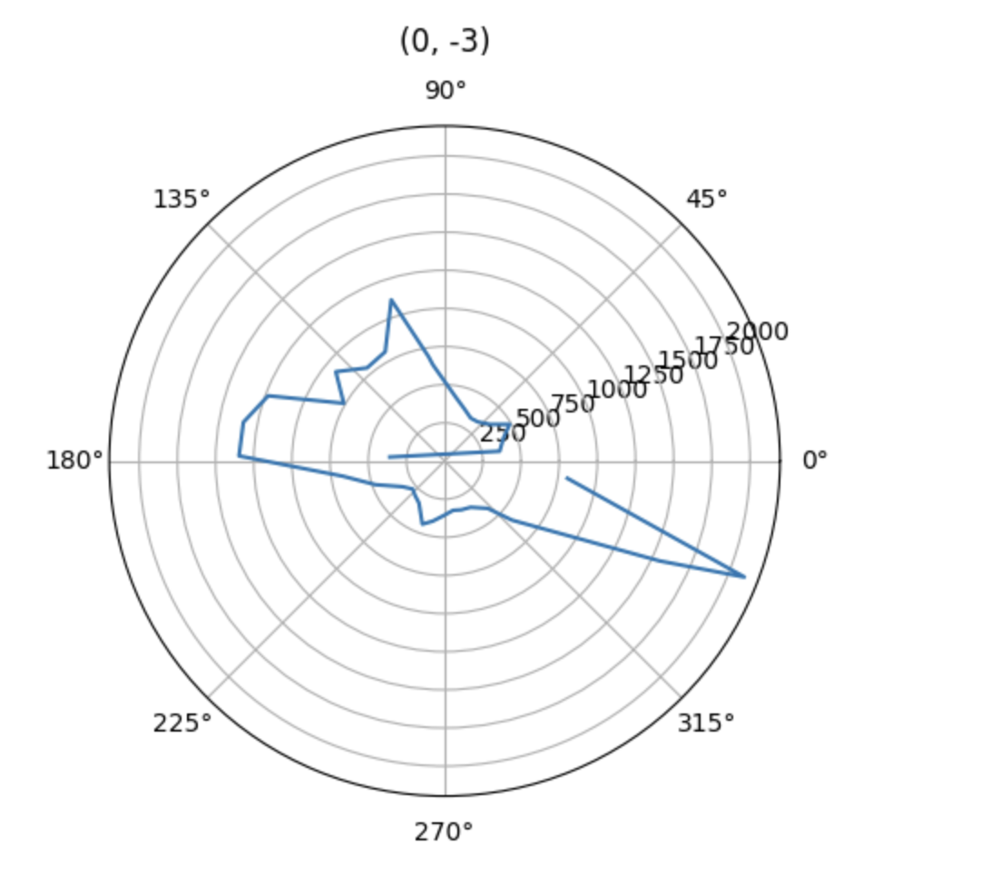
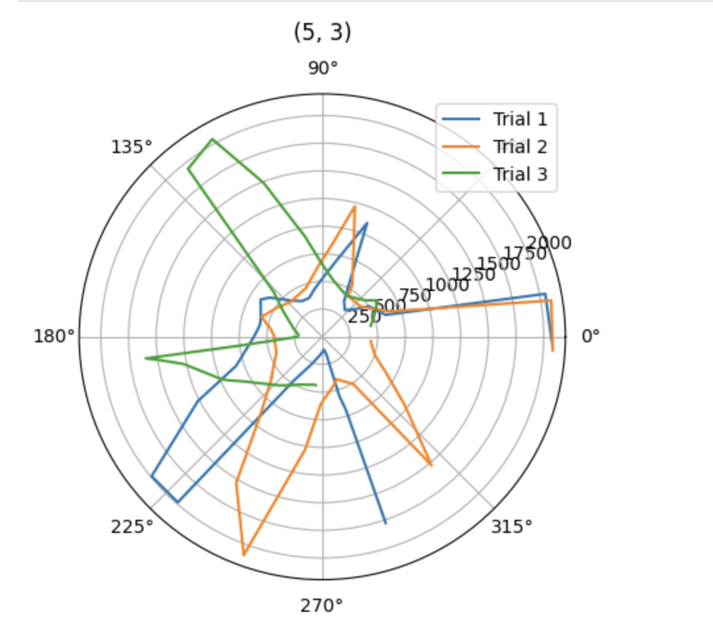
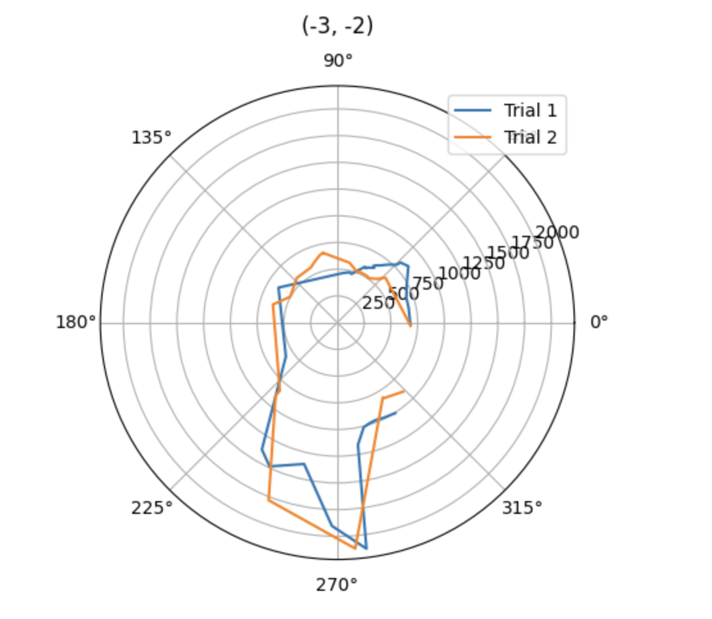
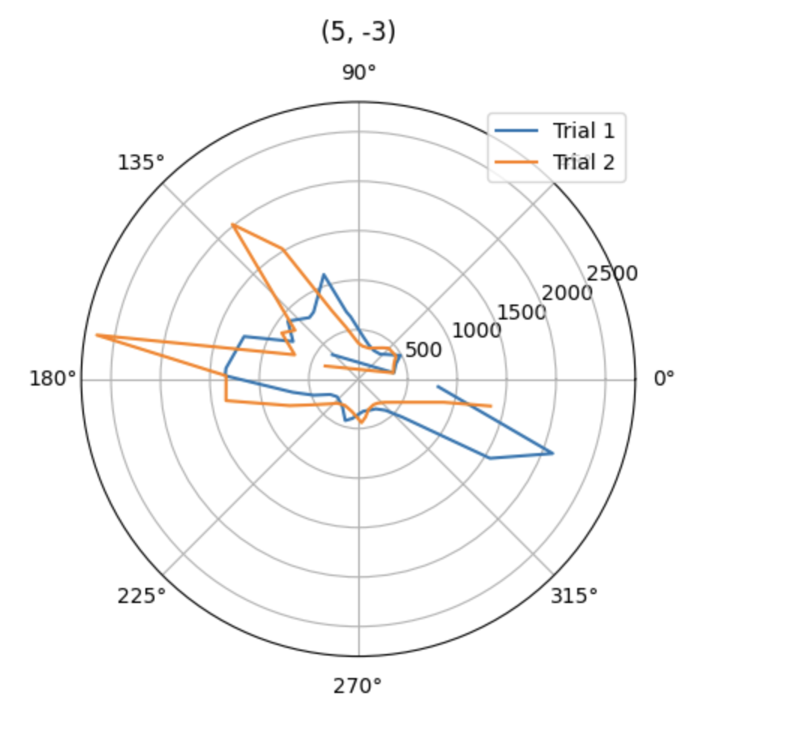
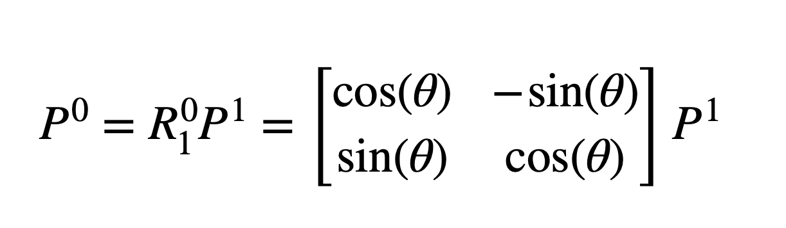
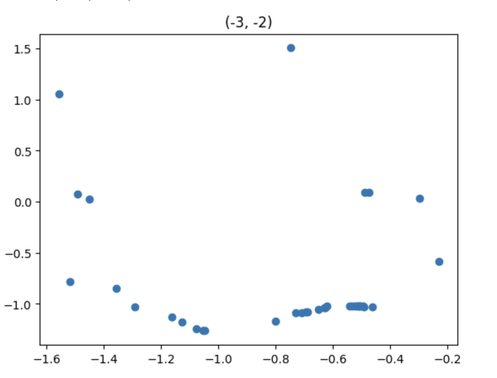
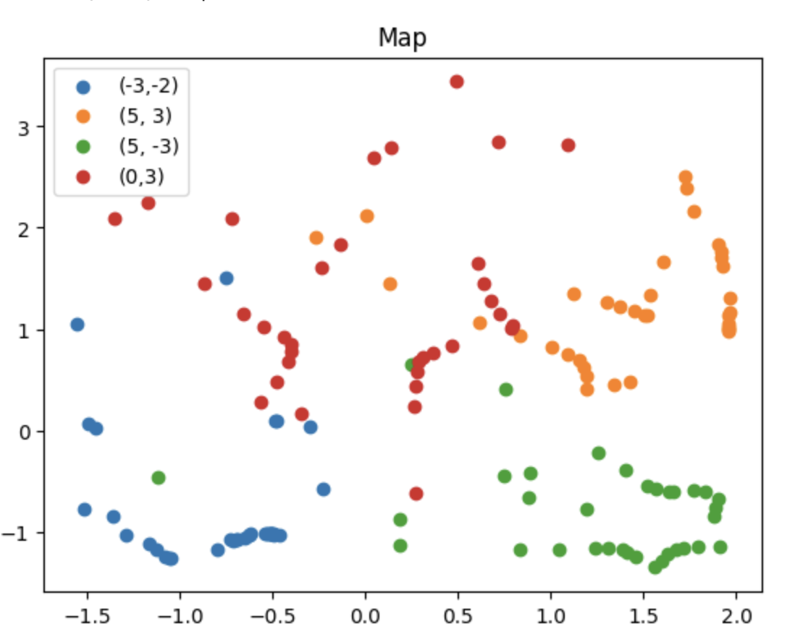
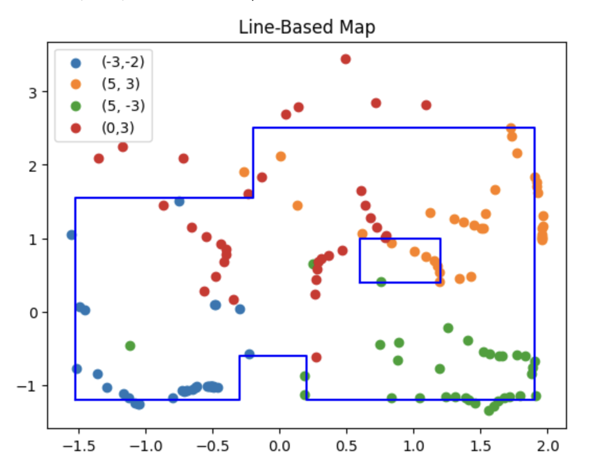

# Lab 9: Mapping

## Control

In order to complete Lab 9, I decided to use orientation control. As in previous labs, I activated my mapping code through a bluetooth command that set the flag, RECORD_MAP, to true. I implemented orientation control using the IMU's gyroscope. As seen in the code included below, the robot turned in increments of 10 degrees, effectively recording a total of 36 distance measurements. Yaw angle was measured continuously in order to accurately track the robot's movement. The desired PWM value was calculated based off yaw, using the same orientation PID function from Lab 6. If the resulting PWM value was positive, the robot was directed to turn right. Otherwise, the robot would turn left. To prevent the robot from unnecessary oscillation, I also directed it to stop moving if the yaw value obtained using the gyroscope was within 2 degrees of the target angle. Once the robot had stabilized at the correct angle, a distance measurement was recorded and the desired angle was updated. 

<pre><code class="language-cpp">
if(RECORD_MAP)
       {
        icm_20948_DMP_data_t data;
        myICM.readDMPdataFromFIFO(&data);

        int dist;
        float yaw_tot;
        float cur_time;
        float dt_map;
        int pwm;
        float yaw_0;
        float yaw_prev;
        float yaw_g;
        //Initial distance measurement (robot doesn't need to start moving)
        if(FIRST_ANGLE)
        {
          //Serial.println("First distance recorded");
            if (distanceSensor_1.checkForDataReady()) {
            meas_dist = distanceSensor_1.getDistance();
            yaw_tot = 0;

            time_stamps[map_meas] = millis();
            dist1[map_meas]=meas_dist;
            yaw[map_meas] = yaw_tot;

            map_meas++;
            distanceSensor_1.clearInterrupt();
            distanceSensor_1.stopRanging();
            distanceSensor_1.startRanging();
            FIRST_ANGLE = false;
            des_angle = 10;
          }
        }
        else{
          if(map_meas < 36)
          {
            float pid_t0 = millis();
            while(millis()-pid_t0 < 1000)
            {
             cur_time = millis();
             dt_map = (cur_time-prev_time_ori)/1000;
             prev_time_ori = cur_time;

             if(myICM.dataReady())
             {
              myICM.getAGMT();
              double yaw_g = myICM.gyrZ();
              yaw_tot = yaw_tot + yaw_g*dt_map;

              pwm = calc_speed_ori(yaw_tot, des_angle, dt_map);            

              if(abs(yaw_tot-des_angle) < 2 || yaw_tot > des_angle)
              {
                analogWrite(1, 0); 
                analogWrite(2, 0); 
                analogWrite(0, 0);
                analogWrite(5,0);
                delay(50);
              }
              else if(pwm>0)
              {
               if(pwm > 130)
               {
                pwm = 130;
               }
               turn_right(pwm);
              }
              else
              {
                pwm=abs(pwm);
                if(pwm > 130)
                {
                  pwm = 130;
                }
                turn_left(pwm);
              }
                }
             }
            
            stopMoving();
            delay(5);

           if (distanceSensor_1.checkForDataReady()) {
             meas_dist = distanceSensor_1.getDistance();
             distanceSensor_1.clearInterrupt();
             distanceSensor_1.stopRanging();
             distanceSensor_1.startRanging();

             time_stamps[map_meas] = millis();
             dist1[map_meas]=meas_dist;
             yaw[map_meas] = yaw_tot;

             Serial.print("yaw meas");
             Serial.println(yaw_tot);
             
             des_angle = des_angle+10;
             Serial.println(des_angle);
             Serial.println(".");
             
             map_meas++;
             prev_err_ori = 0;
             int_error_ori = 0;
           }
        }
         else
         {
          RECORD_MAP = false;
        }
        }
       }
</code></pre>

During testing, I found that the orientation PID control performed optimally when the gains were Kp = 3, Ki = 0.001, and Kd = 3. Evidence for the good performance under these conditions can be seen in the plot below. This graph shows yaw angle versus the desired angle for 3 of my mapping trials, which I will explain later in this report. The measured yaw values from these trials follow the desired angle almost exactly throughout the whole test. This shows that the orientation PID function produced PWM values that allowed the robot to rotate accurately based off its gyroscope readings. 

 

 

The video embedded below shows that my robot does turn on axis, and typically stops when it completes a full 360 degree turn. 

<iframe width="560" height="315" src="https://www.youtube.com/embed/P1vea6lum7I?si=AwDj2OanvwggY9yr" title="YouTube video player" frameborder="0" allow="accelerometer; autoplay; clipboard-write; encrypted-media; gyroscope; picture-in-picture; web-share" referrerpolicy="strict-origin-when-cross-origin" allowfullscreen></iframe>

 

However, something to note is that although my robot was able to accurately follow along with the desired yaw angles as it turned, as seen in the plot above, the IMU's calculated yaw angles were not always entirely accurate with respect to the environment. As discussed in lab 2, the gyroscope yaw has inherent noise and drift, which is likely what caused this deviation. The gyroscope started off giving accurate yaw values, but over time, once it reached approximately 150 degrees, the IMU's measurements no longer lined up with the robot's angle in the environment. For example, the robot would reach 270 degrees but it's gyroscope value would indicate that it had only turned 180 degrees. This led to over-rotation by approximatley 180 degrees for a few of my mapping trials. An example of this behavior can be seen in the video embedded below. So, although distance values collected were accurate, since the robot still rotated on-axis, their corresponding angles were occasionally shifted. This impacted my mapping results, as it was difficult to transform my data if some of the angles were incorrect.  

<iframe width="560" height="315" src="https://www.youtube.com/embed/SkQ8OWAjogU?si=Ezbzg0vcTccOxd69" title="YouTube video player" frameborder="0" allow="accelerometer; autoplay; clipboard-write; encrypted-media; gyroscope; picture-in-picture; web-share" referrerpolicy="strict-origin-when-cross-origin" allowfullscreen></iframe>

 

Overall, though, I do not think my robot would have much of an issue mapping a square, empty room. Even if I encountered the over-rotation issue detailed above, the distance values recorded would all be consistent, so slightly shifted yaw values should not greatly impact the mapping process. 

## Read out Distances 

Once verifying that my controller worked properly, I began testing in the "world" constructed in the lab space. In total, I had 8 successful trials, one at position (0, 3), three at position (5, 3), and two at both (-3, -2) and (5, -3). The polar plots for the data collected at each position are shown below. 

  

 

  

 

Although not perfect, the polar plots do show results that I would expect. For example, at position (-3, -2), the robot started facing forward and proceeded to turn left. Therefore, it makes sense that the largest spike in distance is seen at 270 degrees when it is facing the far right side of the environment. In addition, the results of the (0, 3) polar plot are as expected. At this position, the robot starts facing right, so it has difficulty detecting a distance at first. But, from 90 to 180 degrees, it follows along the top wall, recording consistent distance measurements, except for spikes when it is detects the wall diagonally.

## Transform Data

After verifying my results, I transformed my data from the polar coordinates recorded by my sensors to the inertial reference frame of the room. I used the following equation (taken from the lecture slides) where P1 was [r; 0], where r was the distance measurement and theta was its corresponding yaw value. After rotating, I also translated my data to account for the position where the data was taken. I decided against adjusting for the TOF sensor's placement on my robot since it was only a few centimeters, which would not have made much of a difference based on the scale of my map. 

 

After determining what equation to use, I applied it to my data using the Jupyter code shown below. I have also attached the resulting plot below the code. 

<pre><code class="language-python"
r_pos1 = dist2[:36]
theta_pos1 = yaw2[:36]
y1 = []
x1 = []

for i in range (0,len(r_pos1)):
    x = (r_pos1[i]*np.cos(np.deg2rad(theta_pos1[i]))) - (3*304.8)
    y = (-r_pos1[i]*np.sin(np.deg2rad(theta_pos1[i]))) - (2*304.8)
    x1.append(x/1000)
    y1.append(y/1000)

plt.scatter(x1, y1)
plt.title('(-3, -2)')
</code></pre>

 

 

As mentioned, the plot above is map of the bottom left corner of the environment, which results from transforming the distance and angle data collected at position (-3, -2). In this plot, there are a few points to indicate the left wall, many points for the bottom wall, one point along the top wall, and even some points only part way up the right side which accurately detect the square obtrusion along the bottom wall of the environment. 

## Mapping

After transforming data from all 4 locations, I overlaid them in one map, which can be seen below. 

 

 

Although this map appears a bit noisy, there is still an evident pattern. This pattern becomes more obvious once the walls are drawn in on top. In addition to the map, I have also included my code which creates the lists of the lines to be imported into the simulator for Lab 10. 

 

 

<pre><code class="language-python"
plt.scatter(x1,y1, label = "(-3,-2)")
plt.scatter(x2,y2, label = "(5, 3)")
plt.scatter(x3, y3, label = "(5, -3)")
plt.scatter(x4,y4, label = "(0,3)")

lines_x = [-1.52, -0.3, -0.3, 0.2, 0.2, 1.9, 1.9, -0.2, -0.2, -1.52, -1.52, 0.6, 1.2, 1.2, 0.6, 0.6]
lines_y = [-1.2, -1.2, -.6, -.6, -1.2, -1.2, 2.5, 2.5, 1.55, 1.55, -1.2, 0.4, 0.4, 1, 1, 0.4]

plt.plot(lines_x[:11], lines_y[:11], 'b')
plt.plot(lines_x[11:], lines_y[11:], 'b')

plt.legend()
plt.title("Line-Based Map")
</code></pre>

### Discussion

As you can see in the plot above, I drew the walls in over the data points, including the cluster in the middle right portion which results from detecting the obstruction in the middle of the map. Although I was still able to piece together the correct shape of the environment using my map, it is quite noisy. This is likely a result of the gyroscope value drift, which I touched on in depth above (second to last paragraph of control section and corresponding video). Shifted yaw values likely led to a poor translation into the room's reference frame which in turn resulted in noisy data. 

If I had more time, I would have done additional test runs to gather more data. However, I was not able to fix my robot until lab section today, and only had limited time afterwards to test. I also had to be mindful of the other students who were trying to collect data at the same time as me. Ideally, I would have been able to do at least one test at the origin, but because there were so many students trying to test I decided to stick to the corners. 

In the future, I would switch from using the gyroscope yaw values to the IMU's onboard DMP. Using the DMP instead of the gyroscope may help to reduce error between the yaw measurement and the robot's actual position in the environment. 

### Fun Fact
Also, for anyone who was curious - Espresso is now alive and well! Broken wheel can't stop her :)
