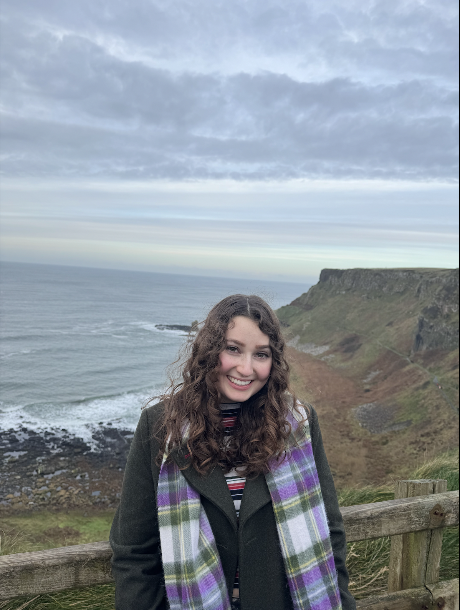

    

  
Hi! My name is Alex Friedman, and I am a MEng student studying mechanical engineering. I am interested in biomechanics and robotics. At Cornell I am a member of SWE Outreach, and I play on the women's club hockey team. As well, I enjoy hiking, reading, and skiing. 

Below you will find an updated account of the work I have done so far this semester in Fast Robots. So far we have completed up to lab 9!

## Labs

- [Lab 1: Artemis & Bluetooth](/Lab1.md)
- [Lab 2: IMU](/Lab2.md)
- [Lab 3: Time of Flight Sensors](/Lab3.md)
- [Lab 4: Motor Drivers and Open Loop Control](/Lab4.md)
- [Lab 5: Linear PID Control and Linear Interpolation](/Lab5.md)
- [Lab 6: Orientation Control](/Lab6.md)
- [Lab 7: Kalman Filter](/Lab7.md)
- [Lab 8: Stunts](/Lab8.md)
- [Lab 9: Mapping](/Lab9.md)
